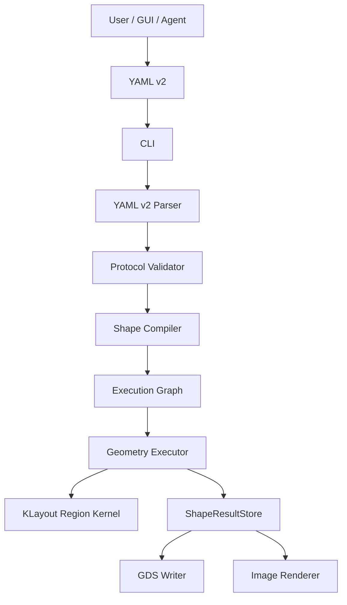
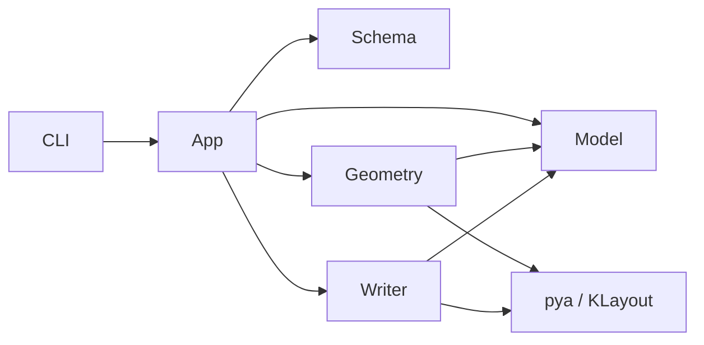
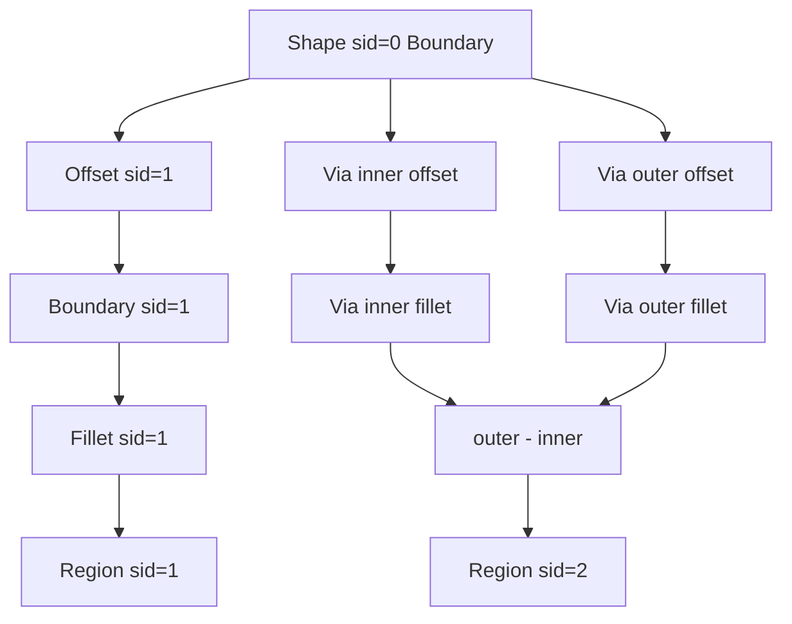

# Program Architecture

## 1. 架构目标

重构后的程序采用 CLI-first 架构：

- GUI、agent、用户脚本都生成 YAML。
- CLI 是稳定执行入口。
- 几何计算集中在 app/core 层。
- GDS writer 和 image renderer 都只接受 RegionObject。

这不是 Web API 优先架构。GUI 可以调用 CLI，也可以复用同一个本地 app service，但不应该重新实现几何逻辑。

## 2. 模块边界



## 3. 推荐目录结构

```text
mvp/src/summer_gds/
  cli.py
  app/
    validate_config.py
    compile_shapes.py
    execute_shapes.py
    export_artifact.py
  schema/
    yaml_v2.py
    errors.py
  model/
    ids.py
    boundary.py
    region.py
    shape_result.py
  geometry/
    fillet.py
    region_adapter.py
    offset.py
    boolean.py
  writer/
    gds_writer.py
    image_renderer.py
```

目录职责：

| 目录 | 职责 |
| --- | --- |
| `cli.py` | 命令行入口，负责参数、退出码、错误打印。 |
| `app/` | 编排层，连接 parser、validator、compiler、executor、output backend。 |
| `schema/` | YAML v2 的文件读取、YAML 解析、schema 映射和协议错误。 |
| `model/` | 内部稳定数据模型，不依赖 YAML 细节。 |
| `geometry/` | 倒角、Region 转换、offset、boolean。 |
| `writer/` | 输出 backend，包括 GDS writer 和 image renderer，只接受 RegionObject。 |

`yaml loader` 不单独成层。理由：

- 文件读取、YAML parse、字段白名单和 dataclass 映射天然属于协议入口。
- 单独 loader 很容易变成只包一层 `yaml.safe_load()` 的空抽象。
- 真正需要隔离的是协议层和几何层，而不是 loader 和 parser。
- 如果未来支持 JSON/TOML，可以新增 `schema/json_v2.py`，而不是提前保留通用 loader。

`schema/yaml_v2.py` 仍必须承担 loader 的安全职责：

- 使用 `yaml.safe_load()` 或等价安全解析器。
- 限制文件大小、YAML depth 和 alias/anchor 扩展。
- 拒绝非 mapping 顶层结构。
- 在 dataclass 映射前拒绝 unknown field。
- 把 parse error、schema error 和 reference error 都转换成统一 `SummerGdsError`。

## 4. 依赖方向



约束：

- `schema` 不依赖 `geometry`。
- `model` 不依赖 `schema`。
- `writer` 不依赖 YAML schema。
- GDS writer 和 image renderer 是同级 output backend，二者都不依赖 GUI。
- KLayout 依赖集中在 `geometry` 和 `writer`。

## 5. Execution Graph

用户 YAML 不需要 DAG，但内部需要 operation dependency graph。

原因：

- `source.ref` 依赖已有 `sid`。
- `base_shape.source.ref + offset` 依赖源图形 canonical boundary。
- `via` 需要从同一 source 生成 inner 和 outer 两条分支。
- `rings` 需要迭代生成每一圈的 inner/outer。

内部 graph 示例：



关键点：

- graph 是实现细节。
- YAML 只暴露业务对象。
- 第一版可用顺序执行实现，不必引入通用 DAG 框架。
- 只要 `source.ref` 必须指向前序 `sid`，拓扑排序可以简化为按 `shapes` 顺序执行。

## 6. ShapeResultStore

执行过程中需要保存每个公开 shape 的结果：

```text
sid -> ShapeResult
```

ShapeResult 至少包含：

- `sid`
- `name`
- `shape_type`
- `canonical_boundary`
- `output_regions`
- `layer`

`canonical_boundary` 用于后续 `source.ref`。它应该是未 boolean 的单连通边界，不应该是 via/rings 的 boolean 结果。

## 7. 为什么不让 YAML 直接描述 Region

Region 是计算内核，不适合作为协议对象：

- Region 可能是多边界、多洞、多岛对象。
- Region 的具体序列化和 KLayout 内部细节有关。
- GUI 更适合表达“我要一个 via/ring/base”，而不是表达布尔后的拓扑结构。

因此协议对象和计算对象必须分层：

```text
YAML ShapeSpec -> BoundaryObject / RegionObject -> GDS
```

## 8. 为什么 output backend 只接受 RegionObject

output backend 接收多种输入会让输出层承担几何语义：

- 裸 vertices 需要 writer 处理闭合、方向、hole。
- BoundaryObject 需要输出层知道是否应直接写 polygon。
- Boolean 结果需要输出层处理 Region。

统一成 RegionObject 后：

- GDS writer 只负责按 layer/datatype 写 KLayout region。
- image renderer 只负责把 RegionObject 画成 SVG preview 或开发/测试用图片 artifact。
- base/via/rings 的差异在 output backend 前已经消失。
- 测试可以只检查每个 backend 是否正确消费 RegionObject。
