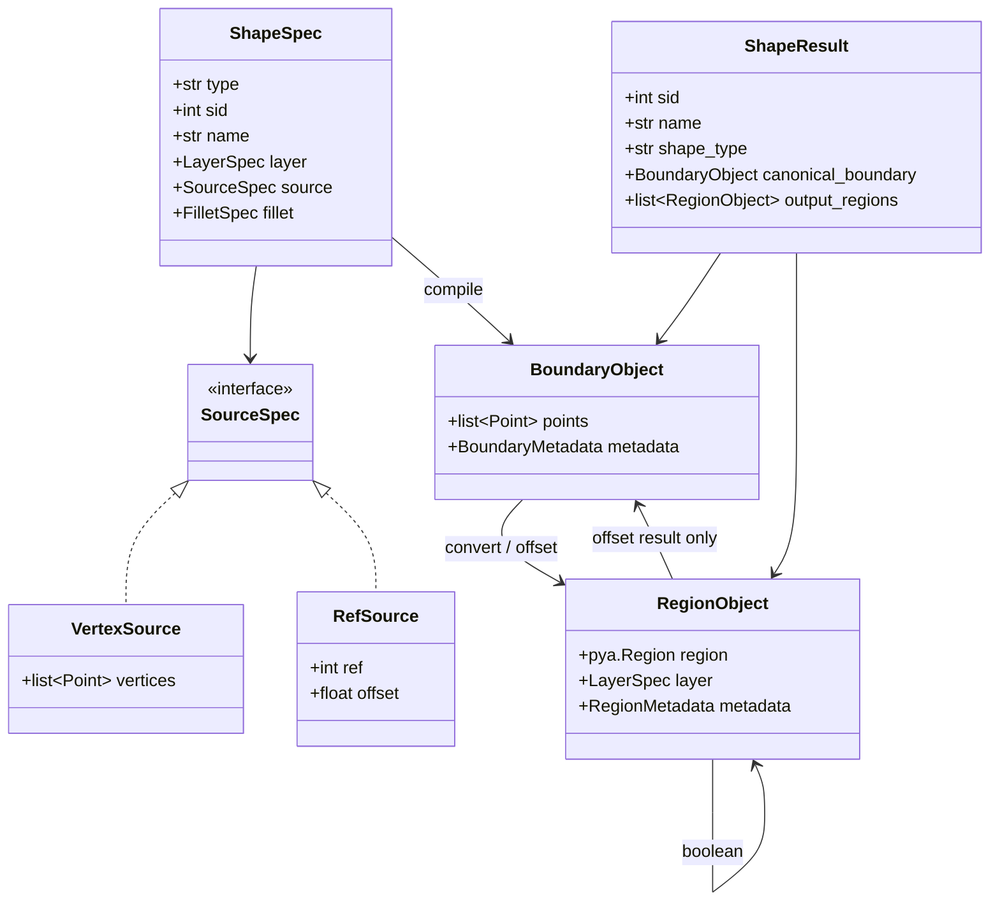

# Data Model

## 1. 分层

数据模型分为三层：

| 层 | 示例 | 责任 |
| --- | --- | --- |
| 协议层 | `ShapeSpec`, `SourceSpec` | 表达 YAML 输入。 |
| 几何层 | `BoundaryObject`, `RegionObject` | 表达可计算几何。 |
| 执行层 | `ShapeResult`, `ShapeResultStore` | 管理依赖和输出结果。 |

协议层不应该直接传给 output backend。GDS writer 和 image renderer 只消费几何层结果。

## 2. ID 模型

| 字段 | 类型 | 作用域 | 说明 |
| --- | --- | --- | --- |
| `sid` | `int` | YAML shape 全局 | 公开 shape id，引用主键。 |
| `name` | `str` | 非唯一 | 人类可读名称，不作为引用键。 |
| `cid` | `int` | corner 局部或全局 | 未来 corner object id。 |
| `oid` | `int` | execution graph | 内部 operation id。 |
| `rid` | `int` | debug/preview | 内部 Region/debug result id。 |

第一版必须实现：

- `sid`
- `name`

第一版可以不暴露：

- `cid`
- `oid`
- `rid`

## 3. ShapeSpec

协议层对象，来自 YAML。

```python
@dataclass(frozen=True)
class ShapeSpec:
    type: Literal["base_shape", "via", "rings"]
    sid: int
    name: str
    layer: LayerSpec
    source: SourceSpec
    fillet: FilletSpec | None
```

不同 shape 类型扩展自己的字段：

```python
@dataclass(frozen=True)
class ViaSpec(ShapeSpec):
    offsets: ViaOffsets

@dataclass(frozen=True)
class RingsSpec(ShapeSpec):
    count: int
    pitch: float
    width: float
```

## 4. SourceSpec

```python
@dataclass(frozen=True)
class VertexSource:
    vertices: list[Point]

@dataclass(frozen=True)
class RefSource:
    ref: int
    offset: float | None = None
```

约束：

- `vertices` 和 `ref` 互斥。
- `ref` 引用 `sid`。
- `offset` 只和 `ref` 一起使用。
- 第一版 `ref` 必须指向前序 shape。

## 5. BoundaryObject

`BoundaryObject` 是单连通边界对象。

```python
@dataclass(frozen=True)
class BoundaryObject:
    points: list[Point]
    metadata: BoundaryMetadata
```

推荐 metadata：

```python
@dataclass(frozen=True)
class BoundaryMetadata:
    source_sid: int | None
    owner_sid: int
    role: Literal[
        "source",
        "base_offset",
        "via_inner",
        "via_outer",
        "ring_inner",
        "ring_outer",
        "filleted",
    ]
    coordinate_unit: str
```

约束：

- `points` 不能是裸数组在系统中到处传递。
- `BoundaryObject` 不表达洞。
- `BoundaryObject` 不表达多个岛。
- 倒角函数只接受 `BoundaryObject`。

## 6. RegionObject

`RegionObject` 包装 KLayout Region。

```python
@dataclass
class RegionObject:
    region: pya.Region
    layer: LayerSpec
    metadata: RegionMetadata
```

推荐 metadata：

```python
@dataclass(frozen=True)
class RegionMetadata:
    owner_sid: int
    role: Literal[
        "base_output",
        "via_inner",
        "via_outer",
        "via_output",
        "ring_output",
        "debug",
    ]
    source_sid: int | None
```

约束：

- offset 输入输出使用 RegionObject。
- boolean 输入输出使用 RegionObject。
- output backend 只接受 RegionObject。
- boolean 后不再转回 BoundaryObject，除非是 debug/preview 专用路径。
- output backend 不得原地修改传入的 RegionObject。
- geometry 操作必须返回新的 RegionObject，不能复用并修改输入对象。
- 如果底层 `pya.Region` API 会原地变更，必须在 adapter 或 operation 边界复制 Region。

推荐提供显式复制方法：

```python
def clone_region_object(region_object: RegionObject) -> RegionObject:
    ...
```

这样可以保证：

- 先渲染 SVG 预览再导出 GDS，与先导出 GDS 再渲染 SVG 预览结果一致。
- `ShapeResultStore` 中保存的 output regions 不会被 writer/image renderer 污染。
- debug overlay 不能改变生产输出。

## 7. ShapeResult

```python
@dataclass
class ShapeResult:
    sid: int
    name: str
    shape_type: str
    layer: LayerSpec
    canonical_boundary: BoundaryObject | None
    output_regions: list[RegionObject]
```

字段说明：

| 字段 | 说明 |
| --- | --- |
| `canonical_boundary` | 给后续 `source.ref` 使用的单连通边界。 |
| `output_regions` | 公开输出 Region，交给 output backend。 |

`canonical_boundary` 是 `source.ref` 的唯一引用目标。

第一版固定规则：

- `base_shape` 的 `canonical_boundary` 是 source 解析完成后的单连通边界。
- 如果 `base_shape.source.vertices`，canonical boundary 是原始 vertices 归一化后的边界。
- 如果 `base_shape.source.ref + offset`，canonical boundary 是 offset 后、fillet 前的边界。
- `canonical_boundary` 永远不是 fillet 后边界。
- `canonical_boundary` 永远不是 boolean 后 Region。
- `via` 和 `rings` 的 `canonical_boundary` 必须为 `None`。

第一版推荐规则：

- `base_shape` 必须有 `canonical_boundary`。
- `via` 和 `rings` 不允许作为 `source.ref` 的目标。

这样可以避免引用 boolean 后的多连通对象。

## 8. 类图



## 9. Point、LayerSpec 和 GeometryContext

```python
@dataclass(frozen=True)
class Point:
    x: float
    y: float

@dataclass(frozen=True)
class LayerSpec:
    layer: int
    datatype: int = 0

@dataclass(frozen=True)
class GeometryContext:
    unit: Literal["um"]
    dbu: float
```

YAML 中 `layer: [1, 0]` 应解析为 `LayerSpec(layer=1, datatype=0)`。

坐标单位规则：

- `BoundaryObject.points` 使用 YAML 单位，第一版固定为 `um` float。
- `RegionObject.region` 使用 KLayout DBU integer 坐标。
- `GeometryContext.dbu` 定义 `1 DBU = dbu um`。
- `BoundaryObject <-> RegionObject` 只能通过 `geometry/region_adapter.py` 转换。
- offset、boolean、GDS writer、image renderer 不得各自实现坐标转换。
- float 到 DBU integer 的 snap 策略必须集中在 region adapter 中。
- 如果点坐标或 offset 无法落到 DBU 网格，应按 adapter 策略统一 snap，并在 debug metadata 中记录。

固定转换策略：

```python
def um_to_dbu(value_um: float, context: GeometryContext) -> int:
    scaled = value_um / context.dbu
    if scaled >= 0:
        return int(math.floor(scaled + 0.5))
    return int(math.ceil(scaled - 0.5))

def dbu_to_um(value_dbu: int, context: GeometryContext) -> float:
    return value_dbu * context.dbu
```

约束：

- 不使用 Python `round()`，避免 bankers rounding 造成半格点不可预期。
- 正数和负数都采用 half-away-from-zero。
- `region_adapter` 必须测试 `0.5 DBU`、`-0.5 DBU`、`1.5 DBU` 和 `-1.5 DBU`。
- GDS writer、image renderer、offset 和 boolean 不能重复实现 `um_to_dbu`。

## 10. 引用语义

`source.ref` 应引用 `ShapeResult.canonical_boundary`。

第一版推荐只允许引用 `base_shape`，理由：

- base_shape 的 canonical boundary 明确。
- via/rings 的公开输出是 boolean 后 Region，不适合作为单边界 source。
- 以后如果需要引用 via/rings，必须先定义清楚引用其哪个边界。

如果用户需要基于 via/rings 的某条边界继续生成图形，应在 YAML 中显式创建中间 base_shape。
