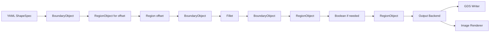
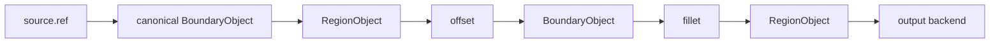
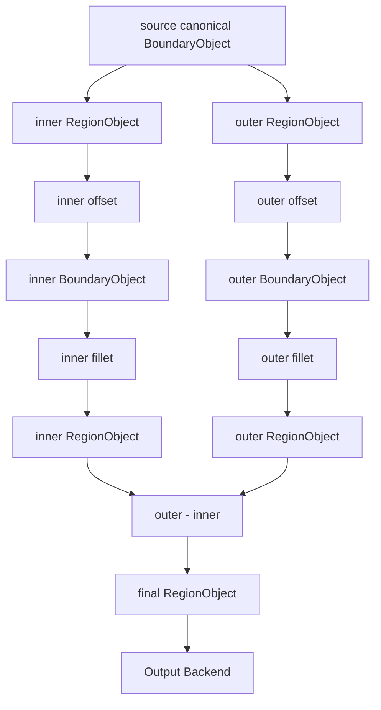
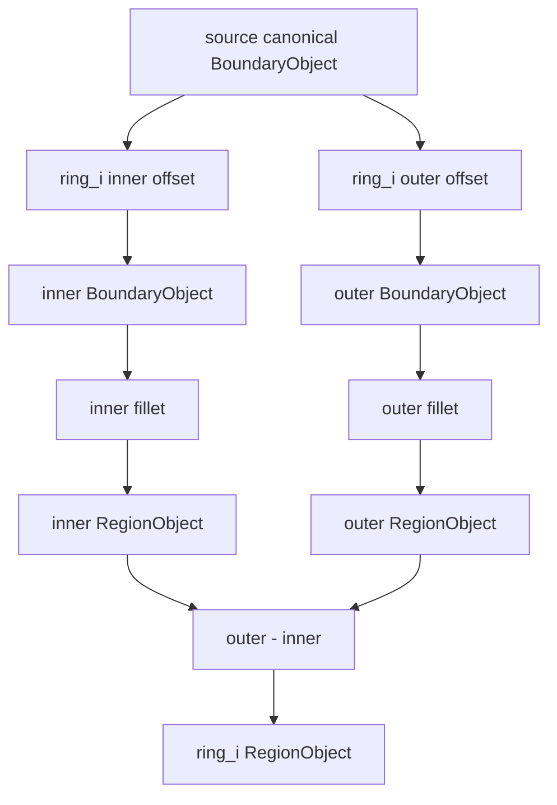
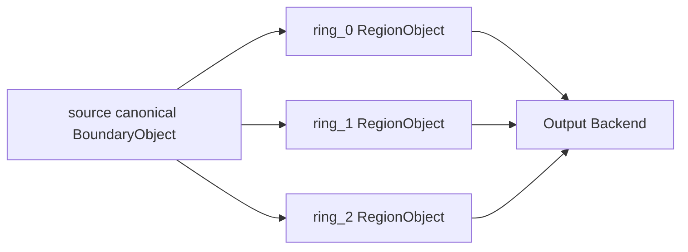
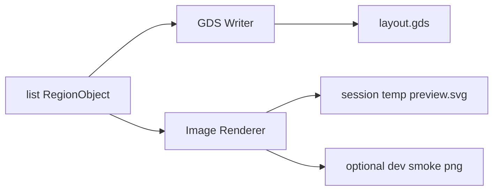

# Processing Pipeline

## 1. 总原则

所有公开 shape 最终都必须进入同一种 output backend 输入格式：

```text
RegionObject
```

完整顺序固定为：

```text
source -> offset -> BoundaryObject -> fillet -> RegionObject -> boolean -> output backend
```

其中：

- offset 必须早于 fillet。
- fillet 必须早于 boolean。
- boolean 后不再回到 BoundaryObject。
- output backend 不接收裸顶点和业务对象。

## 2. 类型生命周期



对于不需要 offset 或 boolean 的对象，相关阶段可以跳过，但类型边界不变。

## 3. base_shape 流程

### 3.1 直接顶点输入


等价文本：

```text
vertices
  -> BoundaryObject
  -> fillet
  -> RegionObject
  -> output backend
```

### 3.2 ref + offset 输入



等价文本：

```text
ref canonical boundary
  -> RegionObject
  -> offset
  -> BoundaryObject
  -> fillet
  -> RegionObject
  -> output backend
```

## 4. via 流程



关键约束：

- inner 和 outer 都基于同一个 canonical source。
- inner/outer offset 后必须能转回单个 BoundaryObject。
- inner/outer 分别倒角。
- boolean 后只保留 RegionObject。

## 5. rings 流程

### 5.1 offset 生成规则

基础形式：

```text
ring_i_inner_offset = i * pitch
ring_i_outer_offset = i * pitch + width
```

其中 `i` 从 `0` 到 `count - 1`。

如果用户希望整体内缩或外扩起步，应先定义一个 offset base_shape，再让 rings 引用它。

### 5.2 单圈流程



### 5.3 多圈流程



第一版不 merge rings：

- 每一圈是一个 RegionObject。
- 同 layer 写入多个 RegionObject。
- 不做合并后的 holes 数量校验。

## 6. 不能先倒角再 offset

错误流程：

```text
source -> fillet -> offset -> boolean
```

问题：

- offset 会改变已倒角弧线的采样点和半径语义。
- 同一个角的倒角精度会在 offset 后变成间接结果。
- 后续 inner/outer 的倒角不再能按用户配置独立控制。

正确流程：

```text
source -> offset -> fillet -> boolean
```

## 7. 不能 boolean 后再倒角

错误流程：

```text
inner/outer offset -> boolean -> fillet
```

问题：

- boolean 后 Region 可能有洞。
- BoundaryObject 第一版只表达单连通边界。
- 倒角算法需要明确的单边界角序列和半径序列。

正确流程：

```text
inner offset -> inner boundary -> inner fillet -> inner region
outer offset -> outer boundary -> outer fillet -> outer region
outer region - inner region
```

## 8. output backend 输入

output backend API 推荐形态：

```python
def export_artifact(regions: list[RegionObject], output: OutputConfig) -> None:
    ...

def write_gds(regions: list[RegionObject], output: GdsOutputConfig) -> None:
    ...

def render_image(regions: list[RegionObject], output: ImageOutputConfig) -> None:
    ...
```

第一版 `ImageOutputConfig` 固定字段：

```python
@dataclass(frozen=True)
class ImageOutputConfig:
    path: Path
    format: Literal["png", "svg"] = "png"
    width_px: int = 1024
    height_px: int = 1024
    max_side_px: int = 4096
    padding_ratio: float = 0.05
    background: str = "#ffffff"
    transparent: bool = False
    layer_style: Mapping[LayerSpec, LayerStyle] | None = None
    show_axes: bool = False
    debug_overlay: bool = False
```

GDS writer 和 image renderer 是同级 backend：



output backend 不应该包含：

- YAML schema 解析。
- BoundaryObject 倒角。
- Region offset。
- boolean 操作。
- source.ref 解析。

GDS writer 只做：

- 创建 layout/cell。
- 按 layer/datatype 写 region。
- 保存 GDS。

image renderer 只做：

- 根据 RegionObject 计算视口。
- 按 layer/datatype 映射颜色。
- 渲染 SVG preview 或开发/测试用图片 artifact。
- 保存到调用方指定路径；GUI preview 调用方必须使用程序内部临时目录。

image renderer 确定性规则：

- 默认 viewport 使用所有非空 RegionObject 的 bounding box。
- viewport 四周增加 `padding_ratio`，默认 `5%`。
- 默认保持几何等比例缩放，不拉伸。
- 如果用户只给 `width_px` 或 `height_px`，另一边按 aspect ratio 推导；如果两者都给，图像 canvas 固定，几何居中。
- 输出像素任一边不得超过 `max_side_px`。
- layer 绘制顺序按 `(layer, datatype)` 升序，后绘制的 layer 覆盖前绘制的 layer。
- 默认颜色由 `(layer, datatype)` 的稳定 hash 生成，同一输入跨机器结果一致。
- hole 必须渲染为背景色或透明区域，不能被填满。
- `debug_overlay` 默认关闭；开启时只能额外绘制 source/offset/fillet 标记，不能改变 final region fill。
- image renderer 不得修改传入的 RegionObject 或底层 `pya.Region`。
