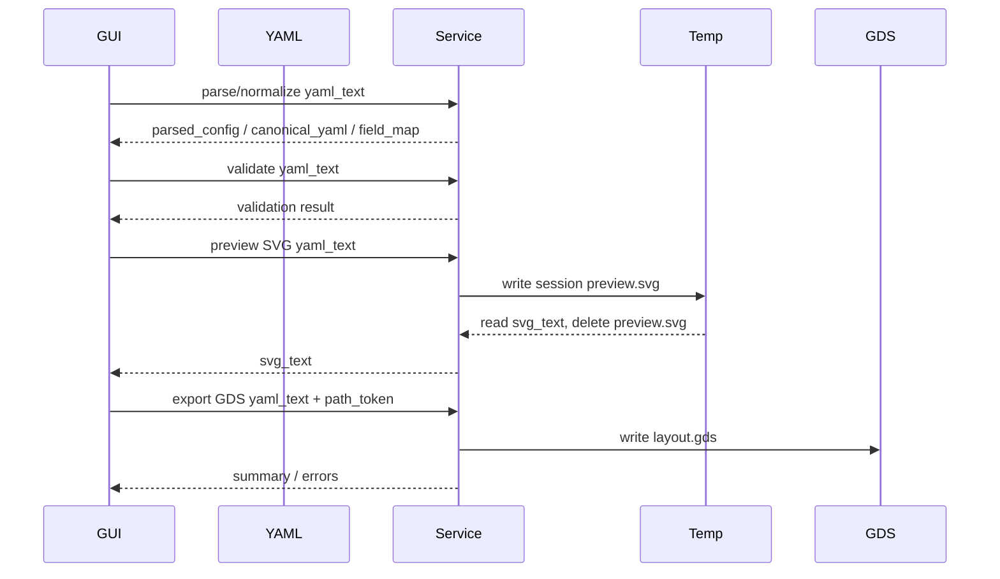

# CLI Contract

## 1. 目标

CLI 是 Summer GDS 的稳定执行入口。

GUI、agent、脚本都应该通过同一套 CLI 或同一 app service 执行，不应该绕过 CLI 重新实现几何逻辑。

CLI 的用户可交付输出 artifact 第一版只承诺 GDS：

- GDS：生产版图输出。

YAML 是正式输入协议，也可以由 GUI 保存为配置文件。GUI 产品层只暴露 YAML 和 GDS 两种用户产物。

底层 app service 可以保留 image renderer，用于 GUI 内部 SVG 实时预览、CI smoke test 和开发诊断。PNG/SVG 文件输出不是 GUI 用户产物。

## 2. 命令

### 2.1 validate

```bash
summer-gds validate config.yaml
```

行为：

- 读取 YAML。
- 执行 schema 校验。
- 执行引用校验。
- 不执行几何 offset/boolean。
- 不选择 output backend。
- 不校验 `gds.output` 是否存在。
- 不写任何 artifact。

`validate` 是协议级预检，只回答“这份 YAML 是否能被 parser 和 ref validator 理解”。

它不回答：

- 这份 YAML 是否能成功生成 GDS。
- 这份 YAML 是否能成功生成内部 SVG 预览。
- 缺省输出路径是否满足某个 backend 的要求。

backend 相关校验必须通过 `export --dry-run` 完成。

成功输出：

```text
OK config.yaml
schema_version: 2
shapes: 4
```

失败输出：

```text
ERROR config_invalid
code: duplicate_sid
path: $.shapes[1].sid
message: sid must be globally unique.
```

### 2.2 export

```bash
summer-gds export config.yaml --format gds --out build/layout.gds
summer-gds export config.yaml --format gds --dry-run
```

行为：

- 先执行 validate。
- 编译 shape execution graph。
- 执行 offset、fillet、boolean。
- 根据 `--format` 切换 output backend。
- GDS 和开发/测试用 image renderer 都从同一批 final RegionObject 生成。

`--dry-run` 行为：

- 执行 validate、compile、geometry runtime validation 和 output backend 前校验。
- 解析并校验最终输出路径。
- 不写任何 artifact 文件。
- 用于 GUI 或 CI 判断某个 backend 是否可执行。

支持格式：

| format | backend | 用途 |
| --- | --- | --- |
| `gds` | `gds_writer.py` | 生产 GDS 输出。 |
| `svg` | `image_renderer.py` | GUI 内部实时预览、开发诊断、CI smoke。 |
| `png` | `image_renderer.py` | 开发诊断和兼容测试，不作为 GUI 产品功能。 |

如果 YAML 中声明默认 GDS 输出：

```yaml
gds:
  output: build/layout.gds
```

则下面命令等价于输出 GDS：

```bash
summer-gds export config.yaml --format gds
```

CLI `--out` 优先级高于 YAML 默认路径。CLI 参数覆盖 YAML 时，必须在日志中显示最终输出路径。

### 2.3 输出路径规则

输出路径解析必须由 CLI/app service 统一完成，不能让各 backend 自己猜。

规则：

- `--out` 是所有 format 的通用输出路径参数。
- `gds.output` 只作为 `--format gds` 的默认输出路径。
- `--format png`、`--format svg` 不读取 `gds.output`。
- 相对路径按 config 文件所在目录解析，不按当前 shell 工作目录解析。
- 最终日志必须打印 resolved absolute path 和原始输入 path。
- 默认不覆盖已存在文件；覆盖必须显式传 `--force`。
- 第一版不自动创建父目录，父目录不存在时报 `output_parent_missing`。
- 写文件必须先写同目录临时文件，再 atomic rename 到目标路径。
- `--dry-run` 不创建临时文件，也不改动已有 artifact。

后缀规则：

| format | 允许后缀 |
| --- | --- |
| `gds` | `.gds` |
| `png` | `.png` |
| `svg` | `.svg` |

路径错误使用 exit code `1` 或 `4`：

- 解析 config 文件失败、父目录不存在、无写权限：`1`。
- backend 写临时文件或 rename 失败：`4`。

### 2.4 generate

为了兼容已有 CLI 习惯，可以保留 `generate` 作为 GDS 快捷命令：

```bash
summer-gds generate config.yaml --out build/layout.gds
```

等价于：

```bash
summer-gds export config.yaml --format gds --out build/layout.gds
```

### 2.5 preview

`preview` 是开发/测试快捷命令，不是 GUI 产品入口：

```bash
summer-gds preview config.yaml --format svg --out build/preview.svg
```

等价于：

```bash
summer-gds export config.yaml --format svg --out build/preview.svg
```

`preview` 不应走独立几何逻辑。它只是在 output backend 选择上切到 image renderer。

GUI 实时预览应优先调用 app service 的 SVG preview API，把 SVG 写入程序内部临时目录，读取后返回 `svg_text`。GUI 不通过 CLI `preview` 生成用户可见文件。

## 3. Debug 输出

推荐参数：

```bash
summer-gds export config.yaml --format gds --out build/layout.gds --debug-dir build/debug
```

debug 目录可包含：

```text
build/debug/
  normalized.yaml
  execution-graph.mmd
  shape-0-source.json
  shape-2-via-inner.json
  shape-2-via-outer.json
  final-regions.json
  preview.svg
```

约束：

- debug JSON 可以包含 Region 转 polygon 的结果。
- debug JSON 不是正式输入协议。
- debug 输出失败不应掩盖正式 output backend 的真实错误。

## 4. 退出码

| 退出码 | 含义 |
| ---: | --- |
| `0` | 成功。 |
| `1` | 文件 IO 错误。 |
| `2` | YAML/schema/ref 校验错误。 |
| `3` | 几何运行时错误，例如 offset/boolean 失败。 |
| `4` | output backend 写出失败，例如 GDS 或内部 image renderer 写出失败。 |
| `5` | CLI 参数错误。 |

## 5. 错误输出格式

默认人类可读：

```text
ERROR geometry_failed
code: offset_empty_region
path: $.shapes[1].source.offset
sid: 1
name: source_pad_margin
stage: offset
message: offset produced an empty region.
```

后续可增加 JSON 报告模式。注意不要复用 `--format`，因为 `--format` 已用于选择输出 artifact backend。

```bash
summer-gds export config.yaml --format gds --report json
```

JSON 输出：

```json
{
  "ok": false,
  "errors": [
    {
      "code": "offset_empty_region",
      "path": "$.shapes[1].source.offset",
      "sid": 1,
      "name": "source_pad_margin",
      "stage": "offset",
      "message": "offset produced an empty region."
    }
  ]
}
```

## 6. GUI 调用约定

GUI 推荐流程：



GUI 只需要理解：

- YAML schema。
- 错误 path。
- `path_token` 和用户可读 `path_label`。

GUI 不应该理解：

- KLayout Region。
- operation graph 内部 node。
- boolean 临时对象。

## 7. App Service

如果 GUI 和 CLI 在同一进程内复用逻辑，应抽出 app service：

```python
def validate_config(path: Path) -> ValidationResult:
    ...

def generate_gds(path: Path, options: GenerateOptions) -> GenerateResult:
    ...

def export_artifact(path: Path, options: ExportOptions) -> ExportResult:
    ...
```

CLI 是 app service 的薄包装。

禁止让 GUI 直接调用：

- `geometry.offset`
- `geometry.boolean`
- `writer.gds_writer`
- `writer.image_renderer`

原因：

- 直接调用会绕过统一校验。
- GUI 和 CLI 行为会分叉。
- 后续 debug 和错误格式会重复实现。
