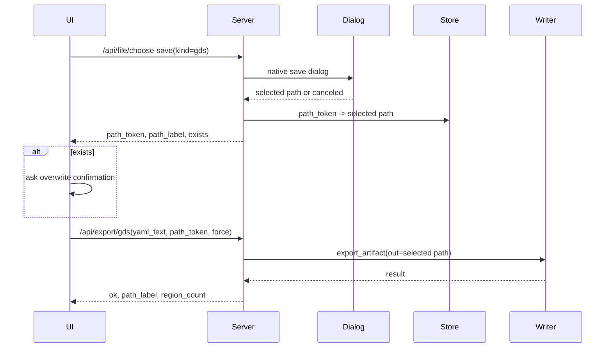
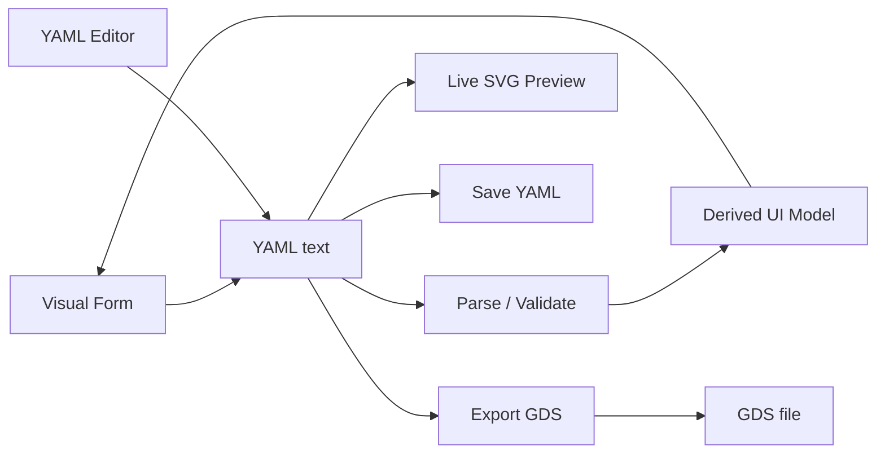

# 前端技术架构 v2.1

文档版本：v2.1
日期：2026-05-24
状态：方案设计

---

## 1. 架构目标

- **Windows 双击启动**：生产版打包为单个 `.exe`，用户不需要安装 Python、Node.js 或命令行工具。
- **纯本地运行**：GUI、静态资源、后端服务和几何流水线都在本机运行；生产版不依赖 CDN。
- **Web UI + Python app service**：前端只负责编辑 YAML 和展示预览，校验、编译、几何和 GDS 输出都走 v2 app service。
- **产品产物只有 YAML 和 GDS**：GUI 支持保存/加载 YAML、导出 GDS；SVG 仅作为实时预览通道，不作为用户导出产物。
- **YAML 是唯一持久化真源**：可视化表单、YAML 编辑器和预览都从当前 YAML 派生。
- **无旧 GUI 依赖**：不继承 `web_gui/` 的 v1 协议、linkage、继承和 override 系统。

## 2. 运行时架构

生产版使用 `pywebview` 嵌入本地页面。系统浏览器只用于开发调试，不作为正式交付路径。

```text
┌──────────────────────────────────────────────┐
│                 SummerGDS.exe                │
│                                              │
│  ┌────────────────────────────────────────┐  │
│  │ pywebview window                       │  │
│  │ ├── local HTML/CSS/JS                  │  │
│  │ ├── visual YAML editor                 │  │
│  │ └── live SVG preview                   │  │
│  └────────────────────────────────────────┘  │
│                    │                         │
│                    │ HTTP / pywebview bridge │
│                    ▼                         │
│  ┌────────────────────────────────────────┐  │
│  │ Flask server on loopback random port   │  │
│  │ ├── validate YAML                      │  │
│  │ ├── render SVG preview                 │  │
│  │ ├── save/load YAML via native dialog   │  │
│  │ └── export GDS via native dialog       │  │
│  └────────────────────────────────────────┘  │
│                    │                         │
│                    ▼                         │
│  ┌────────────────────────────────────────┐  │
│  │ summer_gds.app.service                 │  │
│  │ ├── validate_config_file               │  │
│  │ └── export_artifact(format="gds")      │  │
│  └────────────────────────────────────────┘  │
└──────────────────────────────────────────────┘
```

| 层次 | 技术 | 约束 |
| --- | --- | --- |
| 桌面壳 | `pywebview` + PyInstaller | 生产版必须支持原生打开/保存文件对话框。 |
| 后端 | Flask | 只监听 `127.0.0.1` 随机端口，禁止作为远程服务使用。 |
| 前端 | HTML/CSS/JS + Alpine.js | Alpine 使用本地 vendored 文件，不走 CDN。 |
| YAML 编辑 | CodeMirror 或轻量 textarea fallback | 若使用 CodeMirror，必须 vendor 预构建 bundle。 |
| 样式 | 自定义 CSS + CSS variables | 遵循 `frontend-design-system.md`；不使用 Tailwind CDN；第一版不引入 Node 构建链。 |
| 几何/输出 | v2 app service | GUI 不重复实现 offset、fillet、boolean、GDS writer。 |

## 3. 静态资源策略

生产版禁止从公网加载资源。

```text
v2/gui/static/
├── index.html
├── app.js
├── components.js
├── style.css
└── vendor/
    ├── alpine.min.js
    └── codemirror.bundle.js   # 可选；也可第一版先用 textarea
```

规则：

- `index.html` 只引用本地 `/static/...` 资源。
- `index.html` 的语义 DOM 骨架遵循 [前端设计系统](./frontend-design-system.md)。
- `style.css` 必须从 [前端设计系统](./frontend-design-system.md) 的 CSS tokens 开始。
- 不使用 CDN script/link。
- 不保存 `node_modules/`。
- 如果某个前端库没有稳定的本地单文件分发，第一版宁可降级为原生实现。

## 4. 项目结构

```text
v2/gui/
├── launcher.py              # 入口：启动 Flask + pywebview
├── server.py                # Flask app + API route
├── desktop_api.py           # pywebview native dialog bridge
├── static/
│   ├── index.html
│   ├── app.js
│   ├── components.js
│   ├── style.css
│   └── vendor/
└── README.md
```

`templates/` 第一版不需要。页面使用纯静态 HTML，所有 UI 状态在客户端 JS 中管理。

## 5. GUI API

GUI API 面向本地桌面，不是公共 HTTP API。所有请求必须带 session token。

### 5.1 端点

| 方法 | 路径 | 请求体 | 响应 | 说明 |
| --- | --- | --- | --- | --- |
| `GET` | `/` | - | `index.html` | 主页面。 |
| `POST` | `/api/parse` | `{ yaml_text }` | `{ ok, parsed_config, canonical_yaml, field_map, errors }` | YAML parse + normalize，同步表单用。 |
| `POST` | `/api/validate` | `{ yaml_text }` | `{ ok, errors, summary }` | 协议校验，不写文件。 |
| `POST` | `/api/preview/svg` | `{ yaml_text, request_id }` | `{ ok, svg_text, region_count, errors }` | 实时 SVG 预览，不是导出。 |
| `POST` | `/api/yaml/open` | - | `{ ok, yaml_text, path_label }` | 弹出打开对话框并读取 YAML。 |
| `POST` | `/api/file/choose-save` | `{ kind, suggested_name? }` | `{ ok, path_token, path_label, exists }` | 原生保存对话框，只选择路径，不写文件。 |
| `POST` | `/api/yaml/save` | `{ yaml_text, path_token, force? }` | `{ ok, path_label }` | 写 YAML 到已选择路径。 |
| `POST` | `/api/export/gds` | `{ yaml_text, path_token, force? }` | `{ ok, path_label, region_count }` | 导出 GDS 到已选择路径。 |

不提供 GUI 产品端点：

- `/api/export/png`
- `/api/export/svg`
- `/api/preview/<token>` 返回图片文件

CLI 和底层 app service 可以继续保留 PNG/SVG backend 用于测试或开发调试，但 GUI 第一版不暴露为用户产物。

### 5.2 文件路径规则

GUI 不提供自由文本路径输入。

- 打开 YAML：由原生 open dialog 选择 `.yaml`/`.yml`。
- 保存 YAML：先由原生 save dialog 选择 `.yaml`/`.yml`，返回 `path_token`。
- 导出 GDS：先由原生 save dialog 选择 `.gds`，返回 `path_token`。
- 前端只展示 `path_label`，不要让用户在浏览器表单中手写任意本地路径。
- 后端把真实路径保存在 session-scoped pending path store 中，前端只持有 `path_token`。
- `path_token` 必须绑定 `kind`、session token 和过期时间，例如 10 分钟。
- 保存/导出请求只能使用匹配 kind 的 `path_token`。
- 默认不覆盖已有文件；如果 choose-save 返回 `exists=true`，前端确认后再提交 `force=true`。

`gds.output` 在 YAML 协议中仍可作为 CLI 默认路径存在，但 GUI 导出 GDS 时以用户本次 save dialog 选择为准，并通过 `ExportOptions(out=selected_path)` 覆盖。

两阶段保存/导出流程：



这个方案避免在覆盖确认、重试和超时场景中丢失用户选择的路径，同时不暴露任意文件路径输入。

### 5.3 SVG 预览规则

SVG 预览是内部交互状态，不是用户 artifact。

- 用户编辑 YAML 或表单后，前端 debounce 触发 `/api/preview/svg`。
- 后端复用 v2 几何流水线和 SVG renderer。
- 响应直接返回 `svg_text`，前端内嵌显示。
- 不写入用户选择路径。
- SVG 必须先写入 app 私有临时目录，再读取为 `svg_text` 返回。
- 临时目录按 GUI session 创建，例如 `%TEMP%/summer-gds/gui/<session-id>/preview/`。
- 单次预览文件读取完成后立即删除。
- app 正常关闭时删除整个 session 临时目录。
- app 启动时清理超过 24 小时的旧 `summer-gds/gui/*` 临时目录，覆盖异常退出场景。
- 旧请求返回时，如果 `request_id` 不是当前最新请求，前端必须丢弃结果。

预览限制：

- 后端限制 SVG 文件大小，超过上限返回 `preview_too_large`。
- 后端限制预览请求并发，第一版同一 session 只允许一个 active render。
- 渲染超时后返回 `preview_timeout`，前端保留上一张成功 SVG。

### 5.4 Parse / Normalize API

`/api/parse` 是 YAML 唯一真源策略的关键 API。

职责：

- 接受当前 `yaml_text`。
- 调用 Python v2 parser，不在前端复制 schema parser。
- 返回 `parsed_config`，供表单渲染。
- 返回 `canonical_yaml`，供表单编辑后写回标准 YAML。
- 返回 `field_map`，把 YAML JSONPath 映射到表单字段 id。
- 如果 parse 失败，返回结构化 `errors`，前端进入 `yaml_invalid`。

`/api/parse` 不执行几何、offset、boolean，也不校验输出路径。

示例响应：

```json
{
  "ok": true,
  "parsed_config": {
    "schema_version": 2,
    "global": { "unit": "um", "dbu": 0.001 },
    "gds": { "top_cell": "TOP" },
    "shapes": []
  },
  "canonical_yaml": "schema_version: 2\n...",
  "field_map": {
    "$.global.dbu": "field-global-dbu",
    "$.shapes[0].source.vertices": "field-shape-0-vertices"
  }
}
```

表单编辑流程：

```text
visual edit
  -> update parsed_config draft
  -> serialize draft to YAML
  -> POST /api/parse
  -> parse ok: replace yamlText with canonical_yaml and refresh form
  -> parse error: keep previous valid form state and show field error
```

## 6. 本地安全边界

第一版必须满足：

- Flask 只绑定 `127.0.0.1`，端口启动时随机分配。
- 页面 URL 带一次性 session token，API 请求必须带 token header。
- 禁用 CORS；只接受本 session 页面来源。
- 限制 YAML 请求体大小。
- 禁止任意路径字符串 API。
- 文件读写只能来自原生 dialog 的返回路径。
- debug 模式只允许开发启动，不进入 PyInstaller 生产包。
- 后端错误返回结构化信息，不向前端泄露完整 traceback。

## 7. 数据流



核心规则：

1. YAML text 是唯一持久化真源。
2. Visual form state 是从 YAML parse 出来的派生缓存。
3. 表单编辑必须生成规范 YAML，再从 YAML parse 回 UI model。
4. YAML 编辑器手改成功 parse 后，覆盖 UI model。
5. YAML 编辑器手改失败时，进入 `yaml_invalid` 状态，暂停表单同步和预览/导出。

## 8. 前端状态模型

```javascript
Alpine.store('app', {
  // source of truth
  yamlText: '',
  lastValidYamlText: '',
  parsedConfig: null,
  yamlStatus: 'valid', // valid | invalid | syncing

  // document lifecycle
  currentYamlPathLabel: null,
  dirty: false,

  // validation
  validationErrors: [],
  fieldErrors: {},
  fieldMap: {},

  // live preview
  previewSvgText: '',
  previewStatus: 'idle', // idle | rendering | ready | error
  previewRequestId: 0,

  // operations
  busy: false,
  busyReason: null, // validate | save_yaml | export_gds
  statusMessage: null,
})
```

### 8.1 YAML 状态机

```text
valid
  ├─ visual edit -> generate YAML -> parse ok -> valid
  ├─ YAML edit -> parse ok -> valid
  └─ YAML edit -> parse error -> invalid

invalid
  ├─ YAML edit -> parse ok -> valid
  └─ restore last valid YAML -> valid
```

`invalid` 状态下：

- 保留用户正在编辑的 YAML 文本。
- 禁用实时 SVG 预览。
- 禁用 GDS 导出。
- 表单只显示上次有效配置或进入只读状态，避免覆盖用户错误文本。

## 9. 错误响应格式

```json
{
  "ok": false,
  "errors": [
    {
      "code": "duplicate_sid",
      "path": "$.shapes[1].sid",
      "sid": 1,
      "name": "source_pad",
      "message": "sid must be globally unique."
    }
  ]
}
```

前端必须把 `errors[].path` 映射到表单字段；无法定位字段的错误进入顶部状态摘要。

## 10. Windows 打包

### 10.1 启动流程

```python
def main():
    port = allocate_loopback_port()
    token = create_session_token()
    start_flask_thread(host="127.0.0.1", port=port, token=token)
    webview.create_window("Summer GDS", f"http://127.0.0.1:{port}/?token={token}")
    webview.start()
```

要求：

- 生产版使用 `debug=False`。
- 关闭窗口时停止 Flask 后台线程并清理 temp 目录。
- PyInstaller 包含 `v2/gui/static/**` 和 `summer_gds` package。

### 10.2 打包命令

```bash
pyinstaller --onefile --windowed --name SummerGDS v2/gui/launcher.py
```

## 11. 测试策略

| 层级 | 内容 | 工具 |
| --- | --- | --- |
| 后端 API 测试 | validate、SVG preview、YAML save/load、GDS export | pytest + Flask test client |
| 前端状态测试 | YAML 状态机、dirty、field error mapping | JS unit test 或浏览器测试 |
| 集成测试 | YAML -> SVG preview -> GDS export | pytest |
| 桌面 smoke test | 启动窗口、打开/保存对话框 mock、关闭清理 | pytest/manual |

第一版必须覆盖：

- invalid YAML 禁用预览和导出。
- SVG preview 不生成用户可见文件。
- GDS export 使用 save dialog 路径。
- 已存在文件必须二次确认后才覆盖。
- `rings` 只作为普通 shape 创建，不提供批量 rings 创建功能。
