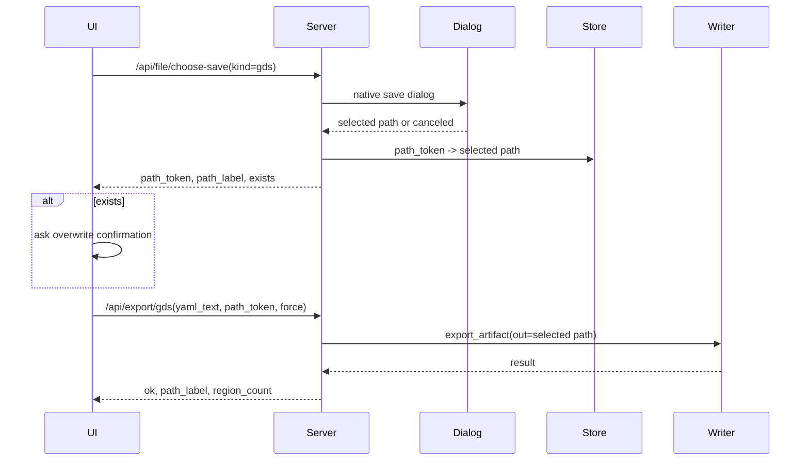
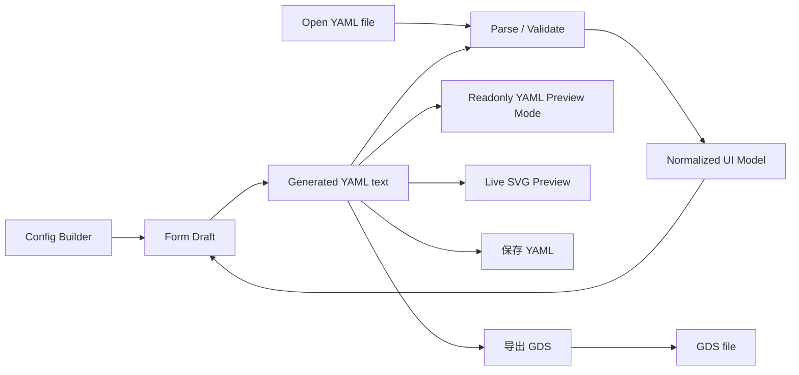

# 前端技术架构 v2.6

文档版本：v2.6
日期：2026-05-25
状态：方案设计

---

## 1. 架构目标

- **Windows 双击启动**：生产版打包为单个 `.exe`，用户不需要安装 Python、Node.js 或命令行工具。
- **纯本地运行**：GUI、静态资源、后端服务和几何流水线都在本机运行；生产版不依赖 CDN。
- **Web UI + Python app service**：前端主交互是配置构建器，用户通过表单、坐标列表输入、逐角倒角列表和 shape 创建动作生成 YAML；校验、编译、几何和 GDS 输出都走 v2 app service。
- **产品产物只有 YAML 和 GDS**：GUI 支持保存/加载 YAML、导出 GDS；SVG 仅作为实时预览通道，不作为用户导出产物。
- **YAML 是唯一持久化真源**：GUI 保存、加载、预览和导出都以 YAML v2 为协议输入；第一版不把手写 YAML 作为主交互。
- **无旧 GUI 依赖**：不继承 `web_gui/` 的 v1 协议、linkage、继承和 override 系统。

## 2. 运行时架构

生产版使用 `pywebview` 嵌入本地页面。系统浏览器只用于开发调试，不作为正式交付路径。

```text
┌──────────────────────────────────────────────┐
│                 SummerGDS.exe                │
│                                              │
│  ┌────────────────────────────────────────┐  │
│  │ pywebview window                       │  │
│  │ ├── local HTML/CSS/JS                  │  │
│  │ ├── visual config builder              │  │
│  │ ├── readonly YAML preview mode         │  │
│  │ └── centered live SVG preview          │  │
│  └────────────────────────────────────────┘  │
│                    │                         │
│                    │ HTTP / pywebview bridge │
│                    ▼                         │
│  ┌────────────────────────────────────────┐  │
│  │ Flask server on loopback random port   │  │
│  │ ├── validate YAML                      │  │
│  │ ├── render SVG preview                 │  │
│  │ ├── save/load YAML via native dialog   │  │
│  │ └── export GDS via native dialog       │  │
│  └────────────────────────────────────────┘  │
│                    │                         │
│                    ▼                         │
│  ┌────────────────────────────────────────┐  │
│  │ summer_gds.app.service                 │  │
│  │ ├── validate_config_file               │  │
│  │ └── export_artifact(format="gds")      │  │
│  └────────────────────────────────────────┘  │
└──────────────────────────────────────────────┘
```

| 层次 | 技术 | 约束 |
| --- | --- | --- |
| 桌面壳 | `pywebview` + PyInstaller | 生产版必须支持原生打开/保存文件对话框。 |
| 后端 | Flask | 只监听 `127.0.0.1` 随机端口，禁止作为远程服务使用。 |
| 前端 | HTML/CSS/vanilla JS | 第一版不需要 Node 构建链；若后续引入小型库，必须本地 vendored，不走 CDN。 |
| 配置构建器 | 原生表单 + JS state | 第一版用户通过表单生成 YAML；不要求代码编辑器组件。 |
| YAML 展示 | readonly textarea / pre | 仅在 `YAML 预览` 模式展示生成的 YAML，供检查和保存，不作为主输入。 |
| 样式 | 自定义 CSS + CSS variables | 遵循 `frontend-design-system.md`；不使用 Tailwind CDN；第一版不引入 Node 构建链。 |
| 几何/输出 | v2 app service | GUI 不重复实现 offset、fillet、boolean、GDS writer。 |

## 3. 静态资源策略

生产版禁止从公网加载资源。

```text
v2/src/summer_gds/gui/
├── templates/
│   └── index.html
└── static/
    ├── app.js
    ├── style.css
    └── vendor/                # 可选；第一版可以不存在
```

规则：

- `templates/index.html` 只引用本地 `/static/...` 资源。
- `templates/index.html` 的语义 DOM 骨架遵循 [前端设计系统](./frontend-design-system.md)。
- `style.css` 必须从 [前端设计系统](./frontend-design-system.md) 的 CSS tokens 开始。
- 不使用 CDN script/link。
- 不保存 `node_modules/`。
- 如果某个前端库没有稳定的本地单文件分发，第一版宁可降级为原生实现。

## 4. 项目结构

```text
v2/src/summer_gds/gui/
├── launcher.py              # 入口：启动 Flask + pywebview 或浏览器开发模式
├── server.py                # Flask app + API route
├── service.py               # GUI-facing service wrapper
├── presenter.py             # UI response/presentation helpers
├── desktop.py               # pywebview/native dialog bridge
├── templates/
│   └── index.html
├── static/
│   ├── app.js
│   └── style.css
└── README.md
```

页面由 Flask 从 `templates/index.html` 提供，JS/CSS 从 `static/` 提供。所有 UI 状态在客户端 JS 中管理；第一版不要求 `components.js`，后续组件拆分时再引入。

## 5. GUI API

GUI API 面向本地桌面，不是公共 HTTP API。所有请求必须带 session token。

### 5.1 端点

| 方法 | 路径 | 请求体 | 响应 | 说明 |
| --- | --- | --- | --- | --- |
| `GET` | `/` | - | `index.html` | 主页面。 |
| `POST` | `/api/parse` | `{ yaml_text }` | `{ ok, parsed_config, canonical_yaml, field_map, errors }` | YAML parse + normalize，同步表单用。 |
| `POST` | `/api/validate` | `{ yaml_text }` | `{ ok, errors, summary }` | 协议校验，不写文件。 |
| `POST` | `/api/preview/svg` | `{ yaml_text, request_id }` | `{ ok, svg_text, region_count, errors }` | 实时 SVG 预览，不是导出。 |
| `POST` | `/api/yaml/open` | - | `{ ok, yaml_text, path_label }` | 弹出打开对话框并读取 YAML。 |
| `POST` | `/api/file/choose-save` | `{ kind, suggested_name? }` | `{ ok, path_token, path_label, exists }` | 原生保存对话框，只选择路径，不写文件。 |
| `POST` | `/api/yaml/save` | `{ yaml_text, path_token, force? }` | `{ ok, path_label }` | 写 YAML 到已选择路径。 |
| `POST` | `/api/export/gds` | `{ yaml_text, path_token, force? }` | `{ ok, path_label, region_count }` | 导出 GDS 到已选择路径。 |

不提供 GUI 产品端点：

- `/api/export/png`
- `/api/export/svg`
- `/api/preview/<token>` 返回图片文件

CLI 和底层 app service 可以继续保留 PNG/SVG backend 用于测试或开发调试，但 GUI 第一版不暴露为用户产物。

### 5.2 文件路径规则

GUI 不提供自由文本路径输入。

- 打开 YAML：由原生 open dialog 选择 `.yaml`/`.yml`。
- 保存 YAML：先由原生 save dialog 选择 `.yaml`/`.yml`，返回 `path_token`。
- 导出 GDS：先由原生 save dialog 选择 `.gds`，返回 `path_token`。
- 前端只展示 `path_label`，不要让用户在浏览器表单中手写任意本地路径。
- 后端把真实路径保存在 session-scoped pending path store 中，前端只持有 `path_token`。
- `path_token` 必须绑定 `kind`、session token 和过期时间；第一版默认 30 分钟，超时后要求用户重新选择路径。
- 保存/导出请求只能使用匹配 kind 的 `path_token`。
- 默认不覆盖已有文件；如果 choose-save 返回 `exists=true`，前端确认后再提交 `force=true`。

`gds.output` 在 YAML 协议中仍可作为 CLI 默认路径存在，但 GUI 不把它当作导出路径输入。

`gds.output` 规则：

- 新建配置不生成 `gds.output`。
- 打开已有 YAML 时，如果存在 `gds.output`，parse/normalize 后仍保存在 form draft 和 generated YAML 中。
- GUI 不提供编辑 `gds.output` 的控件。
- 保存 YAML 时保留导入时已有的 `gds.output`，但不会新增或改写它。
- 导出 GDS 时以用户本次 save dialog 选择为准，通过 `ExportOptions(out=selected_path)` 覆盖 YAML 中的 `gds.output`。
- 导出成功后也不把导出路径写回 YAML。

两阶段保存/导出流程：



这个方案避免在覆盖确认、重试和超时场景中丢失用户选择的路径，同时不暴露任意文件路径输入。

### 5.3 SVG 预览规则

SVG 预览是内部交互状态，不是用户 artifact。

- 用户修改表单后，前端先生成 YAML，再 debounce 触发 `/api/preview/svg`。
- 打开 YAML 文件后，后端 parse 成功并回填表单，随后触发预览。
- 后端复用 v2 几何流水线和 SVG renderer。
- 响应直接返回 `svg_text`，前端内嵌显示。
- 不写入用户选择路径。
- SVG 必须先写入 app 私有临时目录，再读取为 `svg_text` 返回。
- 临时目录按 GUI session 创建，例如 `%TEMP%/summer-gds/gui/<session-id>/preview/`。
- 单次预览文件读取完成后立即删除。
- app 正常关闭时删除整个 session 临时目录。
- app 启动时清理超过 24 小时的旧 `summer-gds/gui/*` 临时目录，覆盖异常退出场景。
- 旧请求返回时，如果 `request_id` 不是当前最新请求，前端必须丢弃结果。
- 前端挂载 SVG 时必须设置或保留 `viewBox`，并强制 `preserveAspectRatio="xMidYMid meet"`。
- SVG 必须放入固定 viewport 的 `.svg-stage` 中居中显示；不能让 SVG 自身的 intrinsic width/height 把图形推到预览区底部。
- `.svg-stage` 默认使用 `display:grid; place-items:center; overflow:hidden`，内部 SVG 使用 `max-width:100%; max-height:100%`。

预览限制：

- 后端限制 SVG 文件大小，超过上限返回 `preview_too_large`。
- 后端限制预览请求并发，第一版同一 session 只允许一个 active render。
- 渲染超时后返回 `preview_timeout`，前端保留上一张成功 SVG。
- 前端在 form draft 已变更但新预览尚未完成时使用 `previewStatus: "stale"`，明确旧 SVG 已过期。

### 5.4 Parse / Normalize API

`/api/parse` 是 YAML 唯一真源策略的关键 API。

职责：

- 接受当前生成的 `yaml_text`，或用户从文件打开的 `yaml_text`。
- 调用 Python v2 parser，不在前端复制 schema parser。
- 返回 `parsed_config`，供表单渲染和文件导入。
- 返回 `canonical_yaml`，供表单生成结果规范化。
- 返回 `field_map`，把 YAML JSONPath 映射到表单字段 id。
- `schema_version` 必须为 `2`；缺失或不匹配时返回结构化错误，不做隐式迁移。
- 如果 parse 失败，返回结构化 `errors`；打开文件时不替换当前表单，表单生成时阻断预览/导出。

`/api/parse` 不执行几何、offset、boolean，也不校验输出路径。

示例响应：

```json
{
  "ok": true,
  "parsed_config": {
    "schema_version": 2,
    "global": { "unit": "um", "dbu": 0.001 },
    "gds": { "top_cell": "TOP" },
    "shapes": []
  },
  "canonical_yaml": "schema_version: 2\n...",
  "field_map": {
    "$.global.dbu": "field-global-dbu",
    "$.shapes[0].source.vertices": "field-shape-0-vertices",
    "$.shapes[0].source.vertices[2][1]": "field-shape-0-vertex-2-y"
  }
}
```

表单编辑流程：

```text
visual edit
  -> update form draft
  -> serialize draft to YAML with schema_version: 2
  -> POST /api/parse
  -> parse ok: replace generatedYamlText with canonical_yaml and refresh normalized form view
  -> parse error: keep current form draft and show field error
```

打开 YAML 流程：

```text
Open YAML
  -> native open dialog
  -> server reads yaml_text
  -> POST /api/parse
  -> parse ok: hydrate form draft from parsed_config and show canonical_yaml
  -> parse error: keep current form draft and show import errors
```

序列化约束：

- 前端 serializer 固定输出 `schema_version: 2`。
- 坐标列表输入解析为 `source.vertices: [[x, y], ...]`，不自动闭合多边形。
- 坐标列表支持每行一个点、分号分隔、旧版冒号分隔和 JSON/YAML 数组子集；格式化后统一显示为一行一个 `x,y`。
- 前端保留顺逆时针检测：`source.vertices` 必须为逆时针、非零面积、首尾不重复；违规直接报错，不自动修正。
- 后端返回 `source.vertices[j][0]` / `[j][1]` 错误时，前端定位到坐标列表和对应行号摘要，而不是行列表格字段。
- `base_shape` 倒角模式为 `none` / `radius` / `radii`；`none` 不写 `fillet`，`radius` 写 `fillet.radius`，`radii` 写 `fillet.radii`。
- direct vertices 模式下，`base_shape.fillet.radii` 使用横向半径列表输入；列表长度必须等于当前顶点数，第 `i` 个半径绑定第 `i` 行顶点。
- `source.ref + offset` 模式也允许 `base_shape.fillet.radii`，但前端不推断 offset 后边界点数，只做数值解析和横向格式化；长度匹配、offset 后拓扑和倒角合法性由 preview/validate 的后端几何流水线判定。
- `via.fillet.inner` 和 `via.fillet.outer` 各自独立支持 `none` / `radius` / `radii`；`radii` 使用横向半径列表输入，前端只校验非负有限数值，长度和 offset 后边界合法性由 preview/validate 判定。
- via 默认启用 outer 同心联动：当 outer 处于 auto 状态时，`outer_radius = inner_radius + (outer_offset - inner_offset)`；逐角时逐项相加。用户手动修改 outer 后进入 override，不再自动跟随；YAML 只保存计算后的普通 `fillet.outer.radius/radii`。
- rings 增加同心展开 GUI 模式：用户配置 base inner 倒角后，前端按 `ring_i_inner_offset = i * pitch`、`ring_i_outer_offset = i * pitch + width` 展开为显式 `fillet.rings`；YAML 协议不新增隐式同心字段。
- `rings` 的 per-ring fillet 只有在用户选择 per-ring 模式时输出；输出数组长度必须等于 `count`。
- `gds.output` 仅在打开的 YAML 已存在该字段时保留；GUI 导出路径不回写到 YAML。

## 6. 本地安全边界

第一版必须满足：

- Flask 只绑定 `127.0.0.1`，端口启动时随机分配。
- 页面 URL 带一次性 session token，API 请求必须带 token header。
- 禁用 CORS；只接受本 session 页面来源。
- 限制 YAML 请求体大小。
- 禁止任意路径字符串 API。
- 文件读写只能来自原生 dialog 的返回路径。
- debug 模式只允许开发启动，不进入 PyInstaller 生产包。
- 后端错误返回结构化信息，不向前端泄露完整 traceback。
- `path_token_expired` 要求用户重新选择路径；前端不得重用过期 token。
- `session_expired` / `unauthorized` 要求用户重启 GUI；第一版不自动续期 session token。
- WebView 到 Flask 的连接失败时显示本地服务中断错误；第一版不要求自动重启 Flask。

## 7. 数据流



核心规则：

1. YAML text 是唯一持久化真源，也是所有后端 API 的输入。
2. GUI 第一版的用户输入主界面是 config builder，不是 YAML 手写编辑器。
3. 表单编辑必须生成规范 YAML，再从 YAML parse 回 normalized UI model。
4. 打开的 YAML 文件只有 parse 成功后才能覆盖当前 form draft。
5. 生成 YAML parse 失败时进入 `yaml_invalid` 状态，暂停预览/导出，并把错误定位到字段。

## 8. 前端状态模型

```javascript
const appState = {
  // visible UI mode
  activeMode: 'builder', // builder | yaml_preview
  globalSettingsOpen: false,

  // editable UI state
  formDraft: null, // serializer always emits schema_version: 2
  importedGdsOutput: null, // readonly preservation of imported gds.output

  // source of truth
  generatedYamlText: '',
  lastSavedOrLoadedYamlText: '',
  parsedConfig: null,
  yamlStatus: 'valid', // valid | invalid | syncing

  // document lifecycle
  currentYamlPathLabel: null,
  dirty: false,

  // validation
  validationErrors: [],
  fieldErrors: {},
  fieldMap: {},

  // live preview
  previewSvgText: '',
  previewStatus: 'idle', // idle | stale | rendering | ready | error | yaml_invalid
  previewRequestId: 0,

  // operations
  busy: false,
  busyReason: null, // validate | save_yaml | export_gds
  statusMessage: null,
}
```

### 8.1 YAML 状态机

```text
valid
  ├─ form edit -> generate YAML -> parse ok -> valid
  ├─ form edit -> generate YAML -> parse error -> invalid
  ├─ open YAML -> parse ok -> valid
  └─ open YAML -> parse error -> import_error

invalid
  ├─ form edit -> generate YAML -> parse ok -> valid
  └─ restore last valid form draft -> valid
```

`invalid` 状态下：

- 保留用户正在编辑的 form draft。
- 禁用实时 SVG 预览。
- 禁用 GDS 导出。
- YAML 预览模式显示当前生成 YAML 和错误摘要，但不要求用户手写修复。

### 8.2 Preview 状态机

```text
idle
  └─ first valid YAML -> rendering

ready
  ├─ form edit + parse ok -> stale
  ├─ form edit + parse error -> yaml_invalid
  └─ manual Fit/Zoom -> ready

stale
  ├─ debounce fires -> rendering
  └─ parse error before render -> yaml_invalid

rendering
  ├─ latest request ok -> ready
  ├─ latest request failed -> error
  └─ superseded request returns -> ignore and keep current state

error
  ├─ form edit + parse ok -> stale
  └─ retry render -> rendering

yaml_invalid
  └─ form edit + parse ok -> stale
```

组合约束：

- `yamlStatus=invalid` 时 `previewStatus` 必须是 `yaml_invalid`，不能是 `ready`。
- `busyReason=export_gds` 时 `data-busy=true`，且 `Export GDS` 按钮禁用。
- `previewStatus=rendering` 不阻塞继续编辑，但旧请求结果必须按 `request_id` 丢弃。
- `previewStatus=stale` 可以继续显示上一张 SVG，但状态文案必须说明旧预览已过期。

## 9. 错误响应格式

```json
{
  "ok": false,
  "errors": [
    {
      "code": "duplicate_sid",
      "path": "$.shapes[1].sid",
      "sid": 1,
      "name": "source_pad",
      "message": "sid must be globally unique."
    }
  ]
}
```

前端必须把 `errors[].path` 映射到表单字段；无法定位字段的错误进入顶部状态摘要。

## 10. Windows 打包

### 10.1 启动流程

```python
def main():
    port = allocate_loopback_port()
    token = create_session_token()
    start_flask_thread(host="127.0.0.1", port=port, token=token)
    webview.create_window("Summer GDS", f"http://127.0.0.1:{port}/?token={token}")
    webview.start()
```

要求：

- 生产版使用 `debug=False`。
- 关闭窗口时停止 Flask 后台线程并清理 temp 目录。
- PyInstaller 包含 `v2/src/summer_gds/gui/templates/**`、`v2/src/summer_gds/gui/static/**` 和 `summer_gds` package。

### 10.2 打包命令

```bash
cd v2
pyinstaller --onefile --windowed --name SummerGDS \
  --collect-data summer_gds \
  src/summer_gds/gui/launcher.py
```

## 11. 测试策略

| 层级 | 内容 | 工具 |
| --- | --- | --- |
| 后端 API 测试 | validate、SVG preview、YAML save/load、GDS export | pytest + Flask test client |
| 前端状态测试 | form draft -> YAML 生成、dirty、field error mapping、SVG 居中挂载 | JS unit test 或浏览器测试 |
| 集成测试 | YAML -> SVG preview -> GDS export | pytest |
| GUI smoke / e2e | 新建 base_shape -> 预览居中 -> 保存 YAML -> mock 导出 GDS | Playwright 或等价浏览器测试 + Flask test server |
| 桌面 smoke test | 启动窗口、打开/保存对话框 mock、关闭清理 | pytest/manual |

第一版必须覆盖：

- invalid YAML 禁用预览和导出。
- 用户可以不手写 YAML 完成 base/via/rings 配置。
- 打开 YAML parse 成功后必须回填表单。
- SVG preview 不生成用户可见文件。
- SVG preview 必须在 viewport 中居中，不能沉到底部。
- GDS export 使用 save dialog 路径。
- 已存在文件必须二次确认后才覆盖。
- `rings` 只作为普通 shape 创建，不提供批量 rings 创建功能。
- `schema_version: 2` 自动写入；v1 或缺失版本导入失败并给出明确错误。
- `gds.output` 导入后保存保留，导出 GDS 不改写。
- `path_token_expired` 要求重新选择路径。
- 坐标列表正确解析并序列化为 `vertices: [[x, y], ...]`，支持长列表滚动、格式化和方向错误提示。
- direct vertices base shape 的逐角倒角正确序列化为 `fillet.radii`，并在数量不等于顶点数时阻止 Apply。
- ref+offset base shape 的逐角倒角允许保存到 YAML；若 radii 数量和 offset 后边界点数不匹配，preview/validate 必须显示后端 `fillet_radii_length_mismatch` 或相关几何错误。
- via inner/outer 的逐角倒角分别序列化为 `fillet.inner.radii` / `fillet.outer.radii`；长度不匹配时由 preview/validate 暴露后端错误。
- via outer 自动同心联动只影响 GUI draft；保存/加载 YAML 后仍回到显式 radius/radii 值，避免协议层出现隐式状态。
- rings 同心展开模式必须生成 `fillet.rings.length === count`；radius 和 radii 都按 ring offset 递增展开。
- `rings.count` 变化时 per-ring fillet 数组不会产生 length mismatch。
- `dbu` / `precision` 联动错误能在 Global 设置中内联显示。
