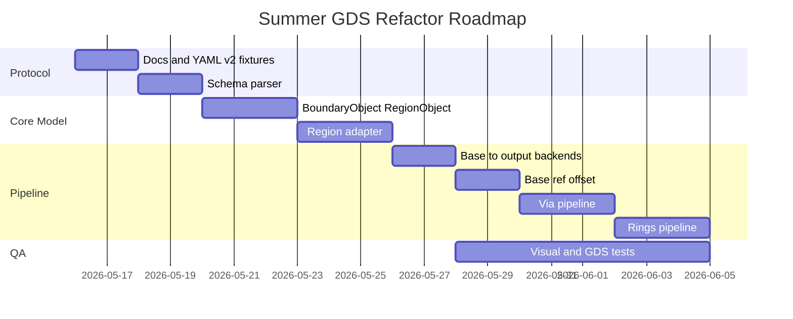

# Implementation Roadmap

## 1. 开发原则

- 先锁协议，再写 GUI。
- 先把 base 跑通到 RegionObject 和 output backend，再加 via/rings。
- 每个阶段都必须有 fixture、测试、可打开 GDS 和可渲染 PNG。
- 不在第一版引入通用复杂拓扑系统。
- 不在 output backend 里塞几何逻辑。

## 2. 阶段总览

时间只是相对排序，不作为承诺排期。

## 3. Phase 0: 文档和 fixtures

目标：

- 锁定 YAML v2。
- 确定 `sid/name/source` 语义。
- 写出 base/via/rings 的最小 fixture。

交付：

- `docs/refactor/*.md`
- `fixtures/v2/valid_base_vertices.yaml`
- `fixtures/v2/valid_base_ref_offset.yaml`
- `fixtures/v2/valid_via.yaml`
- `fixtures/v2/valid_rings.yaml`
- `fixtures/v2/valid_mixed_shapes.yaml`

验收：

- 文档没有 `outputs` 或 `output.enabled` 作为正式协议。
- 示例统一使用 `sid`。
- 示例包含 base、via、rings。

## 4. Phase 1: YAML v2 parser

目标：

- 实现严格 YAML v2 parser。
- 把 YAML 转换为协议层 dataclass。
- 校验 `sid`、`source`、`layer`。
- 保留 loader 安全职责：`safe_load`、文件大小、depth、alias/anchor 限制。
- 明确 `validate` 只做协议级校验，不做 backend 输出路径校验。

交付：

- `schema/yaml_v2.py`
- `schema/errors.py`
- schema 单元测试

验收：

- valid fixture 解析成功。
- duplicate sid、unknown field、invalid source 被拒绝。
- 非有限数值、非法 dbu、precision/dbu mismatch 被拒绝。
- `validate` 不要求 `gds.output`。
- 错误包含 path。

## 5. Phase 2: BoundaryObject / RegionObject

目标：

- 引入内部几何对象。
- 消除核心流水线中的裸 points 传递。
- 封装 KLayout Region。

交付：

- `model/boundary.py`
- `model/region.py`
- `geometry/region_adapter.py`

验收：

- BoundaryObject 可转 RegionObject。
- 单边界 RegionObject 可转回 BoundaryObject。
- 多边界/带洞 RegionObject 转 BoundaryObject 时明确报错。
- `um_to_dbu` 使用 half-away-from-zero，且所有坐标转换集中在 region adapter。

## 6. Phase 3: Output backends Region-only

目标：

- 修改 GDS writer，只接受 `list[RegionObject]`。
- 新增 image renderer，只接受 `list[RegionObject]`。
- 现有 base_shape 输出先转 RegionObject，再按 backend 写出 GDS 或 PNG。
- 实现统一输出路径解析、后缀校验、`--force`、`--dry-run` 和 atomic write。

交付：

- `writer/gds_writer.py`
- `writer/image_renderer.py`
- output backend 单元测试
- base GDS smoke test
- base PNG smoke test

验收：

- GDS writer 不接收 ShapeSpec。
- image renderer 不接收 ShapeSpec。
- output backend 不接收 BoundaryObject。
- 现有 base_shape 生成 GDS 的测试通过。
- 现有 base_shape 生成 PNG 的测试通过。
- `export --format gds --dry-run` 能校验 GDS backend 前置条件但不写文件。
- `export --format png --out preview.png` 不要求 `gds.output`。
- PNG viewport、颜色、layer 顺序和 hole 渲染稳定。

## 7. Phase 4: base_shape ref + offset

目标：

- `base_shape.source.ref + offset` 可用。
- offset 后转回 BoundaryObject。
- offset 后再倒角。

交付：

- `geometry/offset.py`
- base offset pipeline
- invalid offset tests

验收：

- offset base_shape 输出正确 layer。
- offset 后 fillet radii 按当前边界匹配。
- empty/multiple-boundary offset 明确报错。

## 8. Phase 5: via

目标：

- 基于 source 生成 inner/outer。
- inner/outer 分别 offset、倒角。
- boolean diff 后输出 RegionObject。

交付：

- `app/execute_via.py` 或统一 executor 分支
- via fixtures
- via pipeline tests

验收：

- via 输出非空 RegionObject。
- boolean 后不再转回 BoundaryObject。
- inner 大于 outer 等非法情况报 `boolean_empty_region`。

## 9. Phase 6: rings

目标：

- 支持 `count/pitch/width`。
- 每圈生成一个 RegionObject。
- 第一版不 merge。

交付：

- rings executor
- rings fixtures
- rings visual test

验收：

- `count=3` 输出 3 个 ring RegionObject。
- 每圈 offset 符合协议。
- GDS writer 和 image renderer 都能处理同 layer 多个 RegionObject。

## 10. Phase 7: Debug Overlay

目标：

- 在 image renderer 的基础上支持 debug overlay。
- 帮助人工确认 via/rings/fillet。

交付：

- visual fixtures
- debug output directory convention

验收：

- PNG 能显示 base、offset base、via、rings。
- debug overlay 可显示 source/offset/fillet/final region。
- Region 转 list 的逻辑只在 image/debug backend 使用。

## 11. 后续阶段

可后续追加：

- rings merge。
- via/rings 复杂拓扑校验。
- GUI 表单和预览。
- YAML migrator。
- 更细的 DRC 检查。
- operation graph debug dump。

这些不应阻塞第一版 Region 流水线。

## 12. 并行开发建议

可并行：

- YAML parser 与 fixtures。
- RegionObject/output backend 改造。
- GDS writer 和 image renderer。

不建议并行：

- via 和 rings 同时改同一个 executor。
- output backend 改造和 boolean 输出语义未锁定时同时开发 GUI。

原因：

- via/rings 共用 offset/fillet/boolean 管线。
- output backend 输入类型一旦漂移，会拖累所有对象。
- GUI 太早接入会把临时协议固化。
