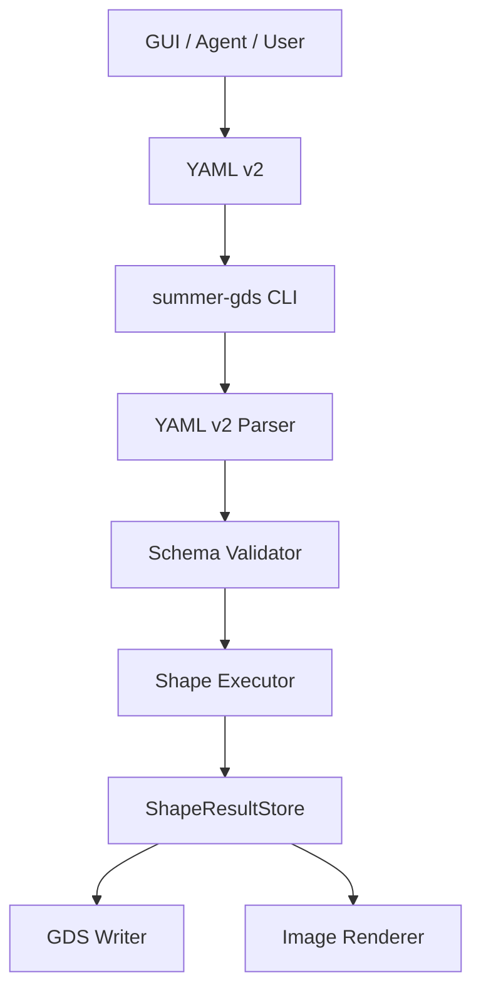

# Summer-GDS 完整产品技术规格总览

文档版本：v2.0
日期：2026-05-16
状态：规划中

---

## 1. 技术目标

完整产品要把当前 MVP 扩展为一条稳定、可测试、可由 GUI 和 agent 自动化驱动的 CLI-first 版图生成流水线。

目标：

- 一个正式 YAML 协议。
- 一个稳定 CLI 执行入口。
- 一个可复用几何流水线。
- `base_shape`、`rings`、`via` 共用 offset / fillet / boolean / 输出能力。
- GUI 只生成 YAML 和调用 CLI，不实现几何逻辑。
- GDS writer 和 image renderer 都只接受 RegionObject，避免输出层理解多种几何形态。

---

## 2. 已锁定决策

| 决策 | 结论 |
|---|---|
| 执行入口 | CLI 为主，GUI 调 CLI 或同一 app service，不走远程 Web API |
| YAML 对象 ID | 使用 `sid`，整数，全局唯一；`name` 只做人类可读标签 |
| YAML 输出语义 | `shapes` 中每个对象都输出，不设置 `outputs` 字段 |
| 内部临时对象 | inner/outer/ring_i_* 只存在于执行图，不进入 YAML |
| offset 顺序 | offset 在倒角前 |
| boolean 顺序 | boolean 在倒角后 |
| boolean 内核 | 使用 KLayout Region，不自研布尔几何 |
| 输出 backend 输入 | GDS writer 和 image renderer 都只接受 RegionObject |
| GUI 产物 | 第一版 GUI 只暴露 YAML 和 GDS；SVG 仅为程序内部实时预览 |
| image renderer | 标准 backend，服务 SVG 预览、CI 和开发诊断；PNG 不作为 GUI 产品功能 |
| YAML 读取 | 文件读取、YAML 解析、schema 映射合并在 `schema/yaml_v2.py`，不单独拆 loader 层 |
| validate 语义 | `validate` 是协议级预检；backend 前置条件通过 `export --dry-run --format ...` 校验 |
| 输出路径 | CLI/app service 统一解析输出路径，默认不覆盖，写出使用同目录临时文件再 atomic rename |
| DBU snap | float 到 DBU integer 只在 region adapter 中执行，采用 half-away-from-zero |
| rings merge | 第一版不支持 merge；同 layer 写多个 ring region |
| 校验范围 | 第一版不做复杂拓扑分类，但做流水线前置条件校验 |

---

## 3. 文档职责

| 文档 | 责任 |
|---|---|
| [YAML v2 协议](./yaml-protocol.md) | 定义用户/GUI 可写配置 |
| [CLI 契约](./cli-contract.md) | 定义命令、退出码、debug 输出和 GUI 调用方式 |
| [程序架构](./architecture.md) | 定义模块边界和依赖方向 |
| [处理流水线](./processing-pipeline.md) | 定义 shape 到 Region 的执行顺序 |
| [数据模型](./data-model.md) | 定义内部对象和 id 命名空间 |
| [校验与错误模型](./validation-and-errors.md) | 定义错误码、错误路径和最低校验 |
| [测试策略](./testing-strategy.md) | 定义测试矩阵和验收口径 |
| [性能与限制](./performance-and-limits.md) | 定义默认上限、benchmark 和规模风险 |
| [实施路线](./implementation-roadmap.md) | 定义开发阶段和并行策略 |

---

## 4. 顶层架构

---

## 5. 后续开发原则

- 先稳定协议，再扩展 GUI。
- 先实现最小可用流水线，再加复杂拓扑校验。
- 不把 GUI 表单细节泄漏到 executor。
- 不把 KLayout Region 泄漏到 YAML。
- 每个新 shape 类型必须有 YAML fixture、unit test、GDS readable test 和 image renderer smoke test。
