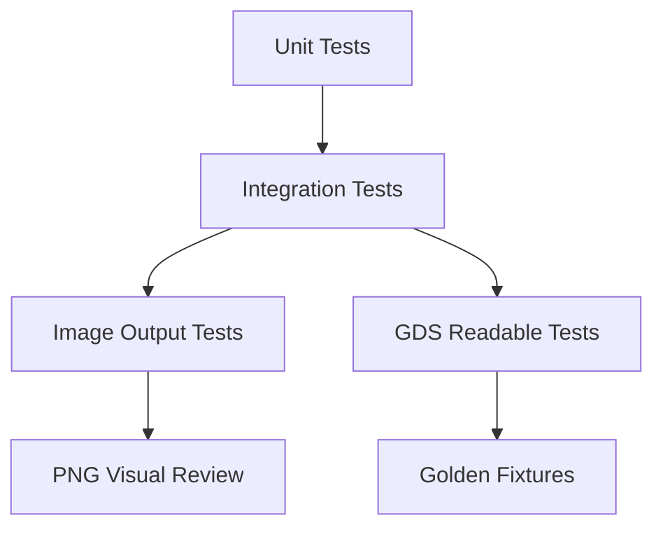

# Testing Strategy

## 1. 测试目标

重构后的测试必须证明三件事：

- YAML v2 协议稳定。
- 几何流水线顺序正确。
- GDS writer 和 image renderer 都只消费 RegionObject，且输出可读/可渲染。

PNG 是标准输出 backend，也可以用于人工检查。几何正确性仍然必须靠几何断言、GDS smoke test 和 PNG smoke test 共同覆盖。

## 2. 测试分层



## 3. 推荐命令

当前本地 arm64 环境：

```bash
PYTHONPATH=mvp/src .venv-arm64/bin/python -m pytest mvp/tests
```

后续可以增加分组：

```bash
PYTHONPATH=mvp/src .venv-arm64/bin/python -m pytest mvp/tests/schema
PYTHONPATH=mvp/src .venv-arm64/bin/python -m pytest mvp/tests/geometry
PYTHONPATH=mvp/src .venv-arm64/bin/python -m pytest mvp/tests/integration
```

## 4. YAML Schema 测试

### 4.1 应通过

| fixture | 覆盖点 |
| --- | --- |
| `valid_base_vertices.yaml` | `base_shape + source.vertices`。 |
| `valid_base_ref_offset.yaml` | `base_shape + source.ref + offset`。 |
| `valid_via.yaml` | `via + offsets.inner/outer`。 |
| `valid_rings.yaml` | `rings + count/pitch/width`。 |
| `valid_mixed_shapes.yaml` | base、offset base、via、rings 同文件。 |

### 4.2 应拒绝

| fixture | 期望错误 |
| --- | --- |
| `invalid_duplicate_sid.yaml` | `duplicate_sid` |
| `invalid_ref_forward.yaml` | `source_ref_not_found_or_not_ready` |
| `invalid_ref_missing.yaml` | `source_ref_not_found_or_not_ready` |
| `invalid_outputs_field.yaml` | unknown field |
| `invalid_output_enabled.yaml` | unknown field |
| `invalid_source_vertices_and_ref.yaml` | source mutually exclusive |
| `invalid_layer.yaml` | layer schema error |
| `invalid_gds_output_missing.yaml` | `export --format gds` 且无 CLI `--out` 时缺少 `gds.output`。 |
| `invalid_non_finite_number.yaml` | `non_finite_number` |
| `invalid_dbu_out_of_range.yaml` | `dbu_out_of_range` |
| `invalid_precision_dbu_mismatch.yaml` | `precision_dbu_mismatch` |
| `invalid_rings_count.yaml` | `invalid_rings_count` |
| `invalid_ring_pitch_width.yaml` | `invalid_ring_pitch_width` |
| `invalid_rings_fillet_length.yaml` | `fillet_rings_length_mismatch` |
| `invalid_yaml_alias_bomb.yaml` | YAML parser resource limit error |

## 5. 数据模型测试

| 测试 | 断言 |
| --- | --- |
| `test_sid_is_int_and_unique` | `sid` 使用整数且全局唯一。 |
| `test_name_not_reference_key` | 相同 name 不影响 ref。 |
| `test_ref_uses_sid` | `source.ref` 只接受 sid。 |
| `test_boundary_object_wraps_points` | 几何函数不传裸 points。 |
| `test_region_object_requires_layer` | output backend 输入必须带 layer。 |
| `test_canonical_boundary_is_prefillet` | `source.ref` 引用 fillet 前 canonical boundary。 |
| `test_region_object_backend_does_not_mutate` | GDS writer 和 image renderer 不原地修改 RegionObject。 |
| `test_region_adapter_owns_dbu_snap` | float/DBU 转换只在 region adapter 中发生。 |
| `test_region_adapter_half_away_from_zero` | `0.5/-0.5/1.5/-1.5 DBU` 按固定策略 snap。 |

## 6. Pipeline 单元测试

### 6.1 base_shape

| 测试 | 断言 |
| --- | --- |
| `test_base_vertices_to_region` | vertices 生成一个非空 RegionObject。 |
| `test_base_ref_offset_order` | offset 发生在 fillet 前。 |
| `test_base_ref_offset_to_boundary` | offset 后能转回单 BoundaryObject。 |
| `test_base_output_backend_input_region_only` | GDS writer 和 image renderer 只收到 RegionObject。 |

### 6.2 via

| 测试 | 断言 |
| --- | --- |
| `test_via_offsets_from_same_source` | inner/outer 都从同一 canonical source 生成。 |
| `test_via_fillet_before_boolean` | inner/outer 倒角后再 boolean。 |
| `test_via_boolean_non_empty` | outer - inner 非空。 |
| `test_via_no_boundary_after_boolean` | boolean 后不回到 BoundaryObject。 |

### 6.3 rings

| 测试 | 断言 |
| --- | --- |
| `test_rings_count` | 输出 region 数量等于 count。 |
| `test_rings_offsets` | 每圈 inner/outer offset 符合 `i*pitch` 和 `i*pitch+width`。 |
| `test_rings_each_ring_boolean` | 每圈 boolean 结果非空。 |
| `test_rings_no_merge_first_version` | output backend 收到多个 RegionObject，而不是强制 merge。 |

## 7. 几何算法测试

| 模块 | 覆盖 |
| --- | --- |
| fillet | 凸角、凹角、共线、零半径、混合半径、精度。 |
| region adapter | BoundaryObject -> RegionObject。 |
| region adapter | RegionObject -> BoundaryObject，仅用于 offset 后单边界。 |
| region adapter | um float -> DBU integer snap 策略集中且可测试。 |
| offset | 正 offset、负 offset、empty region、multiple boundaries。 |
| boolean | union/diff/intersection 基础行为，重点是 diff。 |

重点断言：

- fillet 处理的是 offset 后的 BoundaryObject。
- fillet radii 长度按当前 boundary 顶点数检查。
- concave/convex 都走小圆弧。
- Region 转 boundary 只在合法单边界时成功。

## 8. 集成测试矩阵

| case | 输入 | 输出断言 |
| --- | --- | --- |
| base vertices | 一个矩形 base | GDS 有 1 个 region，PNG 非空。 |
| base offset | base + ref offset base | GDS 有 2 个 layer 输出，PNG 显示两层。 |
| via | base + via | via layer 非空，PNG 可见孔洞区域。 |
| rings | base + rings count=3 | ring layer 有 3 个 region 或等价 polygon 集，PNG 可见三圈。 |
| mixed | base + offset base + via + rings | 所有 sid 输出，GDS 可打开，PNG 可渲染。 |
| invalid offset | 负 offset 吃空 | 报 `offset_empty_region`。 |
| invalid boolean | inner 大于 outer | 报 `boolean_empty_region`。 |

## 9. Image Output 测试

PNG 是第一版标准 image backend。它既服务 GUI 预览，也服务人工检查。

必须测试：

- `export --format png` 会生成文件。
- PNG 文件非空且可被图像库读取。
- base/via/rings 都能渲染。
- 多 layer 有确定的颜色或样式映射。
- layer 顺序按 `(layer, datatype)` 升序。
- viewport padding、aspect ratio 和 max pixel 限制确定。
- hole 渲染为空洞，不被填满。
- `debug_overlay` 不改变 final region fill。
- 空 RegionObject 输入会被拒绝。

人工检查场景：

- base 无 offset。
- base offset。
- via inner/outer 差集。
- rings 多圈。
- via/rings 倒角。

image renderer 只接受 RegionObject，并可额外提供 debug overlay：

- source boundary
- offset boundary
- fillet points
- final region fill

注意：

- PNG 不参与几何语义，但参与正式输出契约。
- Region 转 list 只用于 debug/preview。
- PNG 快照不能替代几何单元测试。

## 10. GDS 测试

每个集成 fixture 都应该有 GDS smoke test：

- 文件存在。
- 可用 KLayout 打开。
- top cell 存在。
- 目标 layer/datatype 有 shape。
- shape 数量或 region 数量符合预期。

不建议第一版做严格二进制 golden GDS，因为 KLayout 写出可能包含非语义差异。

## 11. CLI 和输出路径测试

必须覆盖：

- `validate config.yaml` 不要求 `gds.output`。
- `export --format gds --dry-run` 在缺少 `gds.output` 且无 `--out` 时失败。
- `export --format png --out preview.png` 不读取 `gds.output`。
- `--out` 相对路径按 config 文件所在目录解析。
- 后缀和 format 不匹配时报 `invalid_output_path`。
- 父目录不存在时报 `output_parent_missing`。
- 目标文件存在且无 `--force` 时报 `output_exists`。
- `--dry-run` 不创建、不覆盖任何 artifact。
- 正式写出使用同目录临时文件和 atomic rename。

## 12. 回归测试规则

每新增一个 shape 功能，必须增加：

- 一个 valid YAML fixture。
- 一个 invalid YAML fixture。
- 一个 pipeline 单元测试。
- 一个 GDS smoke test。
- 一个 PNG smoke test。
- 必要时一个 PNG visual review fixture。

每修一个几何 bug，必须增加：

- 最小复现 fixture。
- 几何断言。
- 如果 bug 可视化明显，增加 PNG 输出。
