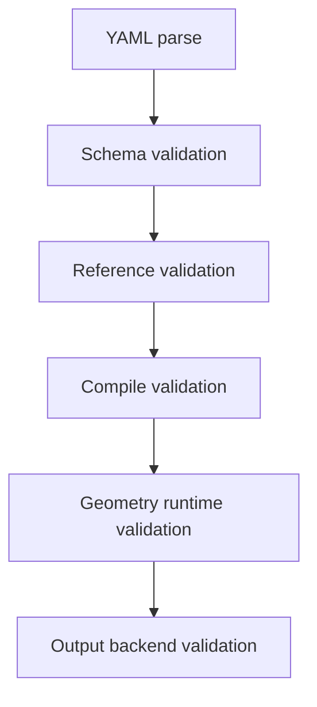

# Validation And Errors

## 1. 校验目标

第一版不追求完整拓扑分类，但必须防止流水线进入不可定义状态。

必须保证：

- YAML 协议字段明确。
- `source.ref` 可解析。
- offset 后能继续倒角。
- boolean 后有可输出 Region。
- output backend 输入不为空。

不保证：

- rings array merge 后 holes 数量。
- 任意多连通图形分类。
- 完整 DRC。
- 所有微小 sliver 风险。

## 2. 校验阶段



## 3. Schema 校验

必须校验：

| 项目 | 规则 |
| --- | --- |
| `schema_version` | 必须为 `2`。 |
| `shapes` | 必须存在且非空。 |
| `type` | 必须是 `base_shape`、`via`、`rings`。 |
| `sid` | 必须为整数，且全局唯一。 |
| `name` | 必须为字符串。 |
| `layer` | 必须是 `[layer, datatype]`，两个非负整数。 |
| `source` | 必须是 `vertices` 或 `ref` 二选一。 |
| `vertices` | 必须是二维数值数组，至少 3 点。 |
| `source.ref` | 必须是整数。 |
| `source.offset` | 如果存在，必须是数值。 |
| `gds.top_cell` | `export --format gds` 或 `export --format gds --dry-run` 时必填，协议级 `validate` 和图片输出可省略。 |
| `gds.output` | `export --format gds` 或 `export --format gds --dry-run` 且 CLI 未传 `--out` 时必填，协议级 `validate` 和图片输出可省略。 |
| `global.unit` | 第一版必须为 `um`。 |
| `global.dbu` | 必须是有限正数，建议默认 `0.001`，第一版允许范围 `0.00001 <= dbu <= 1.0`。 |
| `precision` | 如果存在，必须是有限正数，`precision >= dbu`，且 `precision / dbu` 必须是整数。 |
| 所有坐标、offset、radius、width、pitch | 必须是有限数值，不允许 `NaN`、`inf`、字符串数字或 bool。 |
| `rings.count` | 必须是正整数，且不超过性能上限。 |
| `rings.width` | 必须是有限正数。 |
| `rings.pitch` | 必须是有限正数，第一版要求 `pitch >= width`，避免相邻 ring 默认重叠。 |
| `rings.fillet.rings` | 如果存在，长度必须等于 `rings.count`。 |

禁止字段：

- `outputs`
- `output.enabled`
- `source.vertices` 与 `source.ref` 同时存在
- shape 顶层的 `inner`
- shape 顶层的 `outer`

YAML parser 安全边界：

- 必须使用 `yaml.safe_load()` 或等价安全解析器。
- 顶层必须是 mapping，空文件、list、scalar 都应报 schema 错。
- 第一版最大 YAML 文件大小建议 `1 MiB`。
- 第一版最大 YAML nesting depth 建议 `32`。
- 第一版应拒绝或限制 YAML alias/anchor 扩展，防止资源放大。
- unknown field 必须报错，不能静默忽略。

## 4. 引用校验

第一版采用保守规则：

- `source.ref` 必须指向已出现的前序 `sid`。
- `source.ref` 必须指向有 `canonical_boundary` 的 shape。
- 默认只允许引用 `base_shape`。

这样可以避免：

- forward reference。
- cycle。
- 引用 via/rings boolean 后多连通输出。

错误示例：

```yaml
shapes:
  - type: base_shape
    sid: 1
    source:
      ref: 2

  - type: base_shape
    sid: 2
    source:
      vertices: [[0, 0], [10, 0], [0, 10]]
```

应报错：

```text
source_ref_not_found_or_not_ready
```

## 5. 几何运行时校验

### 5.1 offset 后校验

offset 后必须满足：

- Region 非空。
- 可以转回单个 BoundaryObject。
- 边界点数满足倒角要求。

可能错误：

| 错误码 | 含义 |
| --- | --- |
| `offset_empty_region` | offset 后 Region 为空。 |
| `offset_multiple_boundaries` | offset 后产生多个外边界或洞，无法转回单 BoundaryObject。 |
| `offset_invalid_boundary` | offset 后边界点数或方向非法。 |

### 5.2 fillet 前校验

倒角前必须满足：

- 输入是 BoundaryObject。
- 半径数量与当前 boundary 顶点数量一致，或使用单值 radius 展开策略。
- 半径非负。
- 精度在允许范围内。
- `rings.fillet.rings` 如果存在，长度必须等于 `rings.count`。

注意：半径长度匹配的是 offset 之后的 boundary，不是原始 YAML vertices。

`rings.fillet.rings` 不做隐式广播：

- 省略 `fillet` 或 `fillet.rings`：rings 不倒角。
- 提供 `fillet.rings`：必须逐圈配置，长度等于 `count`。
- 单个配置自动扩展到所有 rings 的行为应由 GUI 或 YAML 生成器完成，不由后端 parser 猜测。

可能错误：

| 错误码 | 含义 |
| --- | --- |
| `fillet_radii_length_mismatch` | 半径数量和当前边界顶点数不一致。 |
| `fillet_rings_length_mismatch` | `rings.fillet.rings` 长度和 `rings.count` 不一致。 |
| `fillet_radius_out_of_range` | 半径为负或过大。 |
| `fillet_precision_out_of_range` | 精度非法。 |
| `fillet_collinear_corner` | 共线角使用正半径且算法不支持。 |

### 5.3 boolean 后校验

boolean 后必须满足：

- Region 非空。
- Region 可被 output backend 消费。

第一版不要求：

- holes 数量为 1。
- rings array merge 后仍满足某种拓扑。
- 输出必须是单 polygon。

可能错误：

| 错误码 | 含义 |
| --- | --- |
| `boolean_empty_region` | boolean 结果为空。 |
| `boolean_invalid_region` | Region 无法输出或内部非法。 |

### 5.4 output backend 前校验

output backend 前必须满足：

- `list[RegionObject]` 非空。
- 每个 RegionObject 有 layer。
- 每个 RegionObject 的 Region 非空。

可能错误：

| 错误码 | 含义 |
| --- | --- |
| `output_empty_input` | 没有任何输出 Region。 |
| `output_region_missing_layer` | RegionObject 缺少 layer。 |
| `output_empty_region` | 某个 RegionObject 为空。 |
| `unsupported_output_format` | 请求的输出格式不支持。 |
| `gds_output_required` | GDS backend 缺少最终输出路径。 |
| `gds_top_cell_required` | GDS backend 缺少 top cell。 |
| `invalid_output_path` | 输出路径为空、后缀错误或解析失败。 |
| `output_parent_missing` | 输出路径父目录不存在。 |
| `output_exists` | 目标文件已存在且未传 `--force`。 |

## 6. 错误路径格式

错误应携带 path，指向 YAML 输入位置或内部阶段。

推荐格式：

```text
$.shapes[2].source.ref
$.shapes[3].fillet.rings[1].inner.radius
$.shapes[1].source.offset
```

几何运行时错误如果无法指向单个 YAML 字段，应指向 shape：

```text
$.shapes[2]
```

并在 detail 中给出阶段：

```json
{
  "code": "offset_multiple_boundaries",
  "path": "$.shapes[1].source.offset",
  "stage": "offset",
  "sid": 1,
  "name": "source_pad_margin"
}
```

## 7. 错误对象

推荐结构：

```python
@dataclass(frozen=True)
class SummerGdsError:
    code: str
    message: str
    path: str
    sid: int | None = None
    name: str | None = None
    stage: str | None = None
    detail: dict[str, Any] = field(default_factory=dict)
```

CLI 输出可以是人类可读文本，也可以后续增加 JSON 模式。

## 8. 第一版不做的校验

明确不做：

- rings array 全局 holes 数量校验。
- merge 后单连通/多连通分类。
- via 结果必须恰好一个洞的严格判定。
- 任意 source graph 的完整 cycle 检测。
- KLayout Region 全量拓扑解释。

这些校验可以后续在 debug/DRC 阶段增加，不应阻塞第一版流水线。

## 9. 最低验收清单

第一版实现必须至少覆盖这些错误：

- `duplicate_sid`
- `non_finite_number`
- `dbu_out_of_range`
- `precision_dbu_mismatch`
- `invalid_rings_count`
- `invalid_ring_pitch_width`
- `gds_output_required`
- `gds_top_cell_required`
- `invalid_output_path`
- `output_parent_missing`
- `source_ref_not_found_or_not_ready`
- `source_ref_not_boundary_capable`
- `offset_empty_region`
- `offset_multiple_boundaries`
- `fillet_radii_length_mismatch`
- `fillet_rings_length_mismatch`
- `boolean_empty_region`
- `output_empty_input`
- `unsupported_output_format`

如果这些错误没有测试覆盖，说明流水线前置条件不完整。
